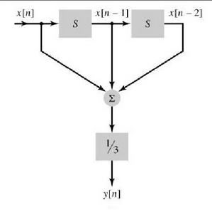
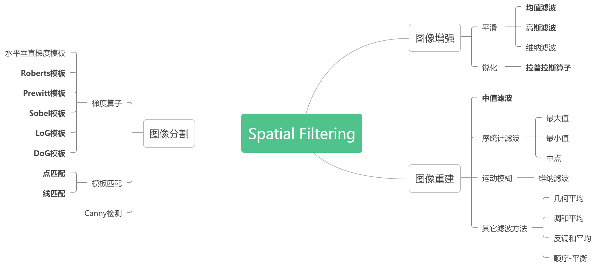
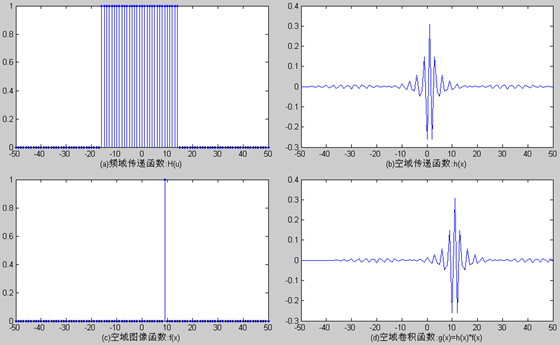
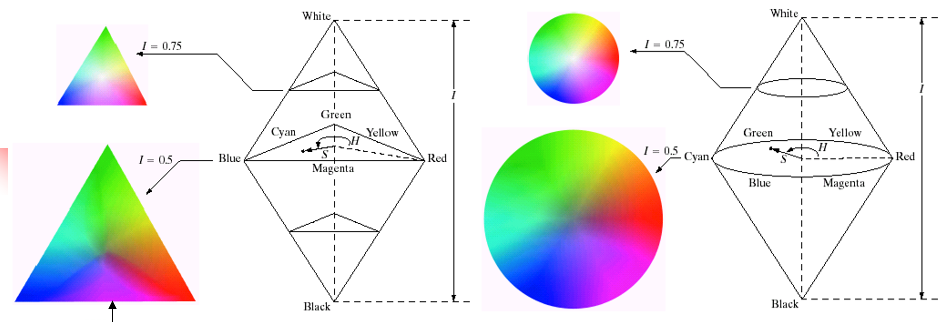
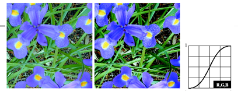
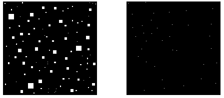
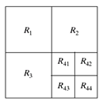

$$
\newcommand\ve[1]{\mathbf{\boldsymbol{#1}}}
\newcommand\nv[1]{\overline{\ve{#1}}}
\newcommand\vd[2]{\ve{#1}^T\ve{#2}}
\newcommand\vc[2]{\ve{#1}\times \ve{#2}}
\newcommand\mat[1]{\begin{pmatrix}#1\end{pmatrix}}
\newcommand\det[1]{\left|\begin{matrix}#1\end{matrix}\right|}
\newcommand\dd{\operatorname{d}}
\newcommand\pd[2]{\frac{\partial #1}{\partial #2}}
\newcommand\ddd[2]{\frac{\dd #1}{\dd #2}}
\newcommand\grad{\triangledown}
$$

# 数字图像处理

这门课由三位老师讲授，但是其PPT可以说差异非常之大。为了更好的覆盖相关知识点，我们会以邸慧军老师的课件为主，但穿插其它老师的相关内容。在展开的时候，邸慧军老师重点讲的内容会标为`[D]`，简单提及的内容为`[d]`；梁玮老师重点讲的内容和简单提及的内容标为`[L]`和`[l]`；武玉伟老师则标为`[W]`和`[w]`。有些内容虽然没有任何老师涉及，但笔者认为是比较重要的内容，则标为`[EX]`。

即便如此，信息整合还是举步维艰。所以我不得不对内容进行非常彻底的重编排，形成下面的结构：

- 综述  这一部分不同老师差别过大，但不是重点，所以只取邸慧君老师的
- 数字图像基础 同上
- 图像变换与点操作 包含邸慧君老师的（3）、（4）前半，武玉伟老师的（3）前半和梁玮老师的（3）前半，主要介绍插值、几何变换、直接对点的操作、直方图均衡化和匹配
- 卷积与卷积定理 这一部分是空间域和频域之间关系的数学基础，包含邸慧君老师的（5）、（6）前半、武玉伟老师的（4）前半、梁玮老师的（4）前半
- 基于空间域的图像增强 这一部分被不同老师打散在不同章节中，这里试图把所有东西都进行整合。因此，涉及的内容非常广，包括邸慧君老师（3）（10）、梁玮老师（3）（5）（10）、武玉伟老师（3）（6）。图像重建这一部分虽然只有梁玮老师单独拿出来一章讲，但是中点滤波、维纳滤波等概念其它老师也有所提及，所以也进行整合；图像分割中的Prewitt核与LoG核等概念武玉伟老师放在了第三章。总结来看，不如全部整合在一起，这样从完整性上更强。 
- 频域图像增强
- 彩色图像处理
- 图像压缩，差别最大的一章，三个老师交集可能只有预测编码和run length code..
- 形态学图像处理
- 图像分割，将其中基于不连续性的分割部分移至前面，但保留了Hough变换和局部处理等部分

[TOC]

## 综述

[D]这一部分相对不重要，因此不做整合。

图像是一种对人类视觉系统的扩展，我们通过图像可以从可见光谱到不可见的波长，从近距离感知到远距离感知。不同的传感器和设备，都可以生成一些图像。除去电磁波之外，我们甚至可以将声波转变为图像信号，电子显微镜看到其它的世界，从图形学合成的图像……视觉对人来说是很重要的信息，靠图像来解放人类的限制。图像显示的介质有很多，从CRT/LCD、HDTV、PDA到3D、VR头盔，发生了很多变化。人类感知图像有很多特色。人对视觉的感知可能是加工后的结果，各种视错觉都存在。

但这部分都不是这门课所考虑的，这门课考虑的主要是三部分：

- manipulation 图像操作
  - 图像的增强
  - 图像的隐藏
  - 图像的影视效果
- compression 图像压缩
  - 节约存储空间
- analysis 图像分析
  - 智能化的分析

可以用这么一张图来表示图像处理的层级：


**图像处理**

图像插值是一种放大图像的技术。如果把图像放大，那么会留下一部分空白，这部分就需要做插值。


图像增强是一种提高对比度的技术。不论是对比度过低还是过高，都可能会导致无法清楚的看到图像。


去噪可以把图像中的噪声去掉。


颜色量化需要把颜色进行压缩。


图像风格化是用另一种照片的风格来美化照片。


**图像压缩**

图像压缩分成两种，有损和无损。这种压缩依赖于概率论和香农信息论。

无损压缩没有任何信息损失，可以完美恢复，压缩系数大约2:1；而有损压缩在视觉范围内可以接收，压缩比大概10-100.JPEG是最典型的有损压缩标准，可以实现一种标准化处理。


**图像分析**

这种分析偏向于高层的图像处理，与人的认知相关联。

边缘检测是把描边进行绘制。


图像分割则是把区域进行分割，这样可以产生图层


图像匹配是从特征点和目标进行匹配


## 数字图像基础

### 图像获取【dlw】

主要做一些背景知识的介绍，不做整合。


晶状体把光投在视网膜上，上边的神经细胞转换成视觉信号。其它结构比如角膜、虹膜都是类似的，而相机则有比较类似的结构。


凸透镜完成光的聚焦，聚到传感器上，CCD是一个感光器件，是光敏感的，转化成电信号。快门打开，充电，快门关闭再打开。因此，快门时间影响光电转换的结果，越亮的地方电压越高。曝光时间越长，结果越亮，所以快门时间有比较大的影响。

如果要彩色图，比较直观的思路是设置三种传感器，不过比较复杂。实际中，我们一般准备一个比较大的传感器，然后对不同结果进行插值，得到结果。


CCD是一行一行处理，CMOS则每个单元都通过CMOS来控制，因此可以控制每一块的通电时间。现在CMOS的效果也比较好了。

从光度学来说，图像成像符合物理模型
$$
f(x, y) = i(x, y) r(x,y) + n(x,y)
$$

- $f(x, y)$ intensity, $(0, +\infty)$
- $i(x,y)$ illumination，$(0,+\infty)$
- $r(x,y)$ reflectance，$(0,1)$，和夹角有关
- $n(x,y)$ 噪音

由于这样的过程存在从连续到离散的转换，所以会进行采样过程。

HDR需要成像过程，就是通过调整光圈，曝光多次，来合成一个比较好的照片。另一种方法是在传感器上蒙一个蒙版来控制光通量，拍出来四种照片，然后做插值，得到最终结果。

### 图像表示和像素之间的关系【DLW】

矩阵表示 用一个矩阵来表示每个像素


矩阵大小称为分辨率。在取值上，也有分辨率的概念。

图像还会定义一个邻域，对于像素$(i,j)$，四邻域是
$$
N_4(p) = \{ (i-1,j),(i,j-1),(i,j+1),(i+1,j) \}
$$

八邻域则是
$$
N_8(p) = N_4(p) \cup \{ (i-1,j-1),(i-1,j+1),(i+1,j+1),(i+1,j-1) \}
$$

对于距离来说，常用欧氏距离、城市块距离和棋盘格距离：


如果像素和邻域内的像素相接触，则成为**邻接**。邻接分为3种：

- 4-邻接，和4-邻域内的像素接触
- 对角邻接，和对角邻域内的像素接触
- 8-邻接，和8-邻域内像素接触

如果两个像素邻接，并且灰度值满足某个相似准则，则称**连接**。连接的标准可能是相等，也可能是某个域值。如果$p,q$两个像素之间存在一条通路，使得通路上任意两个相邻像素都连接，则称为**路径**。

## 图像变换与点操作

算术运算和逻辑运算的部分不是很实用，可参考武玉伟老师课件50-72页，这里不多赘述。

### 图像插值【Dw】

图像是量化后的过程，对于数组来说，每个下标都是整数取值。但如果图像进行旋转，就会出现浮点数格子上的取值。常见的用途有三个：

- 像素放大
- 补充某些损伤
- 波纹等效果

我们需要通过猜测来把某些值得出来，这个操作就是插值。

一维插值最简单的是零阶插值，把最近的值进行拷贝：


此时的表示是一个阶跃函数。线性插值就是画一条线：


当然也有样条插值：


在二维上，进行双线性插值：
$$
(1-a)(1-b)F_{m,n}+(1-a)bF_{m+1,n}+a(1-b)F_{m,n+1}+abF_{m+1,n+1}
$$

### 图像变换【dW】

仿射变换一般能写成
$$
\mat{x' \\ y'} = \mat{a & b \\ c & d} \mat{x \\ y} + \mat{e \\f}
$$
的形式，其中几种经典的变换是：

（1）旋转变换
$$
\mat{x' \\ y'} = \mat{\cos \theta & \sin \theta \\ -\sin \theta & \cos \theta} \mat{x \\ y}
$$
（2）放缩变换
$$
\mat{x' \\ y'} = \mat{a & 0 \\ 0 & b} \mat{x \\ y}
$$
（3）错切变换
$$
\mat{x'\\y'} = \mat{1 & 0 \\ s & 1}\mat{x \\ y}
$$
（4）平移变换
$$
\mat{x' \\ y'} = \ve I \mat{x \\ y} + \mat{a \\ b}
$$
投影变换不属于仿射变换，其形式为
$$
x' = \frac{a_1x+a_2y+a_3}{a_7x+a_8y+1}, y' = \frac{a_4x +a_5 y + a_6}{a_7x + a_8 y + 1}
$$

### Point Operation【DLW】

Point Operatons是一个无需额外空间的操作，把$x \in [0,L]$映射到$y \in [0,L]$。

反色操作：
$$
y = L - x
$$
对比度调整：
$$
y=\begin{cases}\alpha x & 0\le x < a \\ \beta(x-a) + y_a & a \le x < b \\ \gamma(x-b)+y_b & b \le x \le L\end{cases}
$$


切片
$$
y=\begin{cases} 0 & 0\le x < a \\ \beta(x-a)  & a \le x < b \\ \beta(b-a) & b \le x \le L\end{cases}
$$
色域压缩
$$
y = c \lg(1+x)
$$


### 直方图均衡化和匹配【DLW】

直方图均衡化的目标是把直方图变成各个情况分布一样。这里的直方图是指储存每一个亮度的像素点数量，也就是：


但这种方法实现起来会比较麻烦，因为我们无法把一个亮度值拆成多个，否则会出现跳变。因此，没有办法让比较多的变少，只能让比较少的变多。所以我们希望把一些部分合并起来来达到平均值，也就是让
$$
P(a \le G \le b) = \frac{1}{256}
$$
其中$P$是指像素分布的PDF。根据PDF和CDF的关系，
$$
H(b) - H(a) = \frac{1}{256}
$$
现在，我们让$y$轴256等分，即产生256个区间$(\xi_i, \xi_{i+1})$，使得$\xi_{i+1}-\xi_i=\frac{S}{256}$。这样，每一个$(\xi_i, \xi_{i+1})$和区间$(H^{-1}(\xi_i), H^{-1}(\xi_{i+1}))$相对应。当然，上面我们的假设是连续分布，而对于直方图而言，这种变化需要重新进行映射：

```javascript
HISTEQ(f)：							// 求直方图
    for (j, k) in f
        sum[f.Gray(j, k)] += 1			// 求解所有像素值
    g <- f
    S <- 0
    CDF <- 0
    for i = 0 to 255
        S <- S + sum[i]					// 计算所有像素之和
    for i = 0 to 255
        arr <- {}
        for (j, k) in f
            if (Gray(j, k) == i)
                arr <- arr ∪ (j, k)		// 计算数组
        CDF <- CDF + sum[i] / S			// 计算CDF
        for (j, k) in arr
        g.Gray(j, k) <- round(CDF * 255)// 根据CDF反求颜色
    return g
```

也可以分块进行直方图均衡化，得到自适应均衡化。

举一个例子：


> 【L】直方图均衡化的概率推导
>
> 对于一个变换$s = T(r), 0 \le r \le L - 1$，需要满足两个条件：
>
> 1.  $T(r)$在$[0, L-1]$是一个单调递增函数
>
> 2.  $0 \le T(r) \le L - 1$
>
> 条件1确定了输出的强度值不会低于输入之和，条件2确保了输入输出的值域一致性。对于输入$p_r(r)$、输出$p_s(s)$来说，有
>
> $$
> p_s(s) = p_r(r) \frac{dr}{ds} = p_r(r) \frac{dr}{d[T(r)]}
> $$
> 由于人眼的特殊性，我们希望$p_s(s) = \frac{1}{b-a} = \frac{1}{L-1}$。在$[0,1]$上，$p_s(s) = 1$。这就给出：
>
> $$
> s = T(r) = \int_0^r p_r(w) \mathrm{d}w
> $$
> 称上面的变化是均衡化变换。这样，其函数的亮度值会均匀的分布在$[0,1]$之间，从而得到更好的显示效果。
>
> 将上述公式改成离散情形，那么
>
> $$
> s_k = T(r_k) = \sum^k_{j=0} p_r(r_j) = \sum^k_{j = 0} \frac{n_j}{n}
> $$

【dLw】在理想情况下，可以把任何直方图都均衡化成均匀分布。不妨设直方图$H_1$通过变换$T$得到均衡化的$H_0$，$H_2$通过变换$S$得到均衡化的$H_0$。这就指明，
$$
T(H_1) = S(H_2) = H_0
$$
所以
$$
H_2 = S^{-1} \circ T(H_1)
$$
这就实现了两种直方图的匹配。

例如，我们已经知道$r$和其直方图均衡化的结果：


以及希望匹配的目标直方图。这样，我们就可以通过PDF的关联性来建立一种联系：


$p_z(z_q)$一列表示目标匹配的概率分布，而这个累加和真实的$p_z(z_k)$相对应。二者实际上都是均衡化的直方图，此时就建立一种一一对应关系，如果我们已经知道原本$z_q$通过变换$G$得到：


那么我们就可以直接应用$G^{-1}$，得到最终的映射结果$T \circ G^{-1}$：


### Linear Tone Mapping【d】

给出图像$X, Y$，找出$X_y$使得和$Y$有统一的对比度和明度。不妨设变换具有线性形式
$$
X_y = a_0 + a_1 X
$$
那么对于均值方差，
$$
m_{X_y} = a_0 + a_1m_X = m_Y
$$

$$
\sigma _{X_y}=a_1\sigma_X = \sigma_Y
$$

因此，参数估计之后，得到
$$
X_Y = (m_Y - \frac{\sigma_Y}{\sigma_X}m_X) + \frac{\sigma_Y}{\sigma_X}X
$$


## 卷积与卷积定理

### 卷积【Dw】

这一部分邸老师在讲的时候是放在Spatial Filtering之后、Domain Filtering之前作为直观滤波的数学原理讲的，武老师则放在Spatial Filtering之后，梁老师个人感觉没有提相关概念，但PPT是错的，公式反了。

#### Convolution

先给出1D卷积的定义。对于连续函数，
$$
f * g = \int_0^t f(u) h(t-u) \mathrm{d}\, t
$$
对于离散函数，
$$
f * g = \sum_{k=0}^n f[k] h[n-k]
$$

下面，我们用一个直观的例子来解释卷积。

奥特曼的伤害持续5s，每s倍数1-5.也就是说，如果5时刻打了怪兽2滴血，那么7时刻的掉血就是2$\times$倍数2，也就是4滴血.伤害用$x$表示，倍数用$h$表示，那么

- 奥特曼在0时刻打了一下怪兽，$y[n]=h[n]$，输出就是$x[0]h[n-0]$
- 2时刻打了一些怪兽，$y[n]=h[n-2]$，输出就是$x[2]h[n-2]$

所以总的伤害就是$\sum x[k]h[n-k]$。例如，我们要计算7时刻的伤害量，那么就是：

- 3时刻的打击量乘上4个时刻的伤害倍数
- 4时刻的打击量乘上3个时刻的伤害倍数
- ……
- 7时刻的打击量乘上0个时刻的伤害倍数

可以看到，卷积实际上是对之前的效应之和进行累加。

> 信号与系统视域下的Convolution
>
> 信号就是一个函数，包含了某些信息，对它进行采样就得到离散时间信号。而图像实际上就是一个二维函数，是一个二维信号。
>
> 系统接收某些信号，输出某些信号。比如相机把光线信息转换成图像，图像滤波也是一个系统，把输入信号转换成输出信号。系统和系统之间可以串联，比如一个滑动平均系统：
>
> 
>
> 两个延时系统、一个求和系统、一个除三系统，综合成了一个系统。
>
> 其中最重要的一种，就是**线性时不变系统**。时不变系统的特征是不随时间变化，也就是输入的延迟和输出相同步：
>
> 
>
> 而线性系统则是具有均匀性和叠加性的系统：
>
> **Superposition 叠加性**
> $$
> x_1(t)\to y_1(t), x_2(t) \to y_2(t) \Rightarrow x_1(t) + x_2(t) \to y_1(t) + y_2(t)
> $$
> **Homogeneity 均匀性**
> $$
> x_1(t)\to y_1(t) \Rightarrow ax_1(t) \to ay_1(t)
> $$
> 接下来我们引入Impulse Response（冲激响应）。一个简单的例子是，
>
> 一般化的，我们定义
> $$
> \delta(k) = \begin{cases}1 & k=0 \\ 0 & k\ne 0\end{cases}
> $$
> 这个函数有性质
> $$
> \int_{-\infty}^{+\infty} \delta(t)\mathrm d \,t = 1
> $$
> 它具有如下性质：
>
> **选择性**
> $$
> f(t)\delta (t-u) = f(u)\delta (t-u)
> $$
> **信号采样**
> $$
> \int_t f(t)\delta(t-u) = \int_tf(u)\delta(t-u) = f(u)
> $$
> 因此，信号可以组合成冲击的组合体：
>
> **信号分解**
> $$
> f(t) = \int_u f(u) \delta(t-u)
> $$
>  如果已知输入信号的冲激响应是$h(t)$，那么对于输入
> $$
> x(t)=\int_u x(u) \delta (t - u)
> $$
> 则对于响应
> $$
> y(t) = \int_0^t x(u) h(t - u)\mathrm{d}\,u  = x * h
> $$
> 这就引入了卷积。另一方面，从变换角度，我们知道经典的变换：
> $$
> \mathscr{F}(\omega) = \int_{-\infty}^{+\infty} f(t)e^{-j\pi \omega t} \mathrm{d}\,t
> $$
> 而拉氏变换和Z变换有类似的形式，都可以概括成
> $$
> \mathscr{F}(x) = \int f(t)x^t \mathrm d\,t
> $$
> 那么对于系统，如果系统$h$，输入$f$，输出$g$，而如果做变换之后，输入$F$，系统$H$，输出$G$，那么空间域上的卷积就变成了频域上的乘法。这也就是卷积定理：
> $$
> G(x) = F(x)\cdot H(x) = \int f(u)x^u \mathrm d\, u \int h(v)x^v  \mathrm d \,v = \iint f(u)h(v)x^{u+v}\mathrm d u\mathrm dv
> $$
> 令$u+v=t$，
> $$
> G(x) = \iint f(u) h(t-u)x^t \mathrm du\mathrm dt = \int \left(\int f(u) h(t-u)\mathrm du \right) x^t \mathrm dt
> $$
> 而中间的恰好是一个卷积：
> $$
> G(x) = \int (f*h) x^t \mathrm dt = \int g(t)x^t \mathrm dt
> $$
> 

当计算卷积的时候，我们可以先进行翻转然后求解。


对于二维卷积，就进行横纵坐标的翻转。这里要分清楚相关（Correlation）和卷积（Convolution）操作：相关不进行翻转，直接累加求和；卷积需要进行翻转。


#### 卷积的特性

卷积符合如下特性：

**Commutative**
$$
a * b = b * a
$$
**Associative**
$$
(a*b)*c = a*(b*c)
$$
**Distributive**
$$
a*(b+c)=a*b+a*c
$$
**Derivative**
$$
g'(t)=f(t)*h'(t)=f'(t)*h(t)
$$
**Convolution with impulse**
$$
f(t)*\delta(t)=f(t)
$$

### 1D傅里叶变换【d】

在工科数学分析中，我们已经讨论过Fourier级数：
$$
f(x) = \frac{a_0}{2} +\sum_{n=1}^{\infty} \left(a_n \cos \frac{n\pi x}{l} + b_n \sin \frac{n\pi x}{l}\right)
$$
其中，
$$
a_n = \frac{1}{l} \int_{-l}^l f(x) \cos \frac{n\pi x}{l}\dd x, b_n = \frac{1}{l} \int_{-l}^l f(x) \sin \frac{n\pi x}{l}\dd x
$$
它有相应的复数形式
$$
f(x) = \sum_{-\infty} ^{+\infty} c_n \exp \left(i \omega_n x\right)
$$
其中，
$$
\omega_n = \frac{n\pi}{l}, c_n = \frac{1}{2l} \int_{-l}^{l} f(\xi) \exp\left(-i \omega_n \xi\right) \dd \xi
$$
如果把$l$延拓到$\infty$去，也就是把无穷当成周期，此时，$\omega_{n+1}-\omega_n = \frac{\pi}{l}\to 0$。则有
$$
\begin{aligned}
f(x) &= \lim_{l \to \infty}  \sum_{-\infty} ^{+\infty} \left[\frac{1}{2l} \int_{-l}^{l} f(\xi) \exp\left(-i \omega_n \xi\right) \dd \xi\right] \exp \left(i \omega_n x\right) \\
&=\lim_{\Delta \omega_n \to 0} \sum_{-\infty} ^{+\infty} \left[\frac{1}{2\pi} \int_{-\infty}^{\infty} f(\xi) \exp\left(-i \omega_n \xi\right) \dd \xi\right] \exp \left(i \omega_n x\right) \Delta \omega_n \\
&=\frac{1}{2\pi} \int_{-\infty}^{\infty} \left[\frac{1}{2\pi} \int_{-\infty}^{\infty} f(\xi) \exp\left(-i \omega_n \xi\right) \dd \xi\right] \exp \left(i \omega_n x\right)\dd \omega
\end{aligned}
$$
需要注意的是，上面的推导是非常不严谨的，因为无穷级数可交换极限符号的条件是比较苛刻的。实际上，Fourier变换只需要满足Dirichlet条件：

- 具有有限个间断点
- 具有有限个极值点
- 绝对可积

即可进行。这样就形成了Fourier变换和逆Fourier变换：
$$
G(\omega) = \int_{-\infty}^{+\infty} f(x) e^{-i\omega x} \dd x
$$

$$
f(x) = \frac{1}{2\pi} \int_{-\infty}^{+\infty} G(\omega) e^{i\omega x} \dd \omega
$$

下面举一个例子。考虑下图的方波：


对其施以Fourier Transform，则
$$
\mathscr{F}(f(t)) = \int_{-\infty}^{+\infty} f(t) e^{-j2\pi \mu t} \dd t = \int_{-W/2}^{W/2}Ae^{-j2\pi \mu t}\dd t=AW\frac{\sin (\pi \mu W)}{\pi \mu W}
$$
傅里叶变换有如下特点：

- 实函数，$F(-\omega)=F^* (\omega)$
- 实函数的$Re(\omega)$是偶函数，$Ie(\omega)$是奇函数
- 实函数，$f(-x)\to F^*(-\omega)$
- 实偶函数的傅里叶变换是实偶函数
- 实奇函数的傅里叶变换是纯虚奇函数
- 线性性 $h(x)=af(x)+bg(y)$，则$H(\omega)=aF(\omega)+bG(\omega)$
- 平移性 $h(x)=f(x-x_0)$，$H(\omega)=e^{-2\pi x_0\omega}f(\omega)$
- 缩放性 $h(x)=f(ax)$，$H(\omega)=\frac{1}{|a|}F(\omega/a)$

接下来考虑离散函数。由于我们只有信号的某一些采样点，相当于有一系列的冲击函数$\delta(t-n\Delta T)$。这些冲击函数乘上原来的信号函数$f(t)$，得到的是按照频率分布的一系列脉冲波：
$$
\tilde{f}(t) = \sum_{-\infty} ^{+\infty} f(t) \delta(t - n\Delta t)
$$


对其进行FFT。根据卷积定理，相当于频域上的卷积。经过一系列的推导（过程略去），得到
$$
\tilde{F}(\omega) = \frac{1}{\Delta T} \sum_{-\infty}^{+\infty} F(\omega - \frac{n}{\Delta T})
$$
可以看到，这一结果实际上是一系列对某个函数的无限延拓。


接下来，我们考虑其数值。由于
$$
F(\omega) = \int_{-\infty}^{+\infty}  \sum_{n=-\infty}^{+\infty} f(t) \delta(t-n\Delta T)e^{-j\omega t} \dd t = \sum_{n=-\infty}^{+\infty} f_n e^{-j\omega nT}
$$
这就建立了DFT正变换与逆变换：
$$
F(u) = \sum_{x=0}^{N-1}f(x)e^{-j\frac{2\pi ux}{N}}, f(x) = \sum_{0}^{N-1} f(u) e^{j\frac{2\pi \mu x}{N}}
$$

### 2D傅里叶变换【DLW】

2D离散傅里叶变换由下面的式子给出：

$$
F(u,v) = \sum_{x=0}^{M-1} \sum_{y=0}^{N-1} f(x, y) \exp (-2\pi i(ux/M + vy/N))
$$

$f(x, y)$是一个$M\times N$的图片，称变换之后的$F(u,v)$为频域。

逆变换IDFT则由下面的式子给出：

$$
f(x, y) = \frac{1}{MN} \sum_{u=0}^{M-1} \sum_{v =0}^{N-1} F(u, v) \exp (-2\pi i(ux/M + vy/N))
$$
其模
$$
|F(u,v)| = \sqrt{Re^2(u,v) + Im^2(u,v)}
$$
幅角
$$
\phi(u,v) = \arctan \left[\frac{Im(u,v)}{Re(u,v)}\right]
$$
功率谱
$$
P(u,v) = |Re^2(u,v) + Im^2(u,v)|
$$

### 卷积定理【DLW】

对1D分析。考虑$f,g$进行卷积操作，有
$$
(f \star g)(t) = \int_{-\infty}^{+\infty} f(\tau) g(t-\tau)\dd \tau
$$
进行Fourier Transform
$$
\mathscr{F}((f \star g)(t)) = \int _{-\infty}^{+\infty} \left[\int _{-\infty}^{+\infty}f(\tau) g(t-\tau)\dd \tau \right]e^{-i\omega t} \dd t
$$
交换积分次序，得到
$$
\int _{-\infty}^{+\infty}f(\tau) \left[\int _{-\infty}^{+\infty} g(t-\tau)e^{-i\omega t}\dd t \right] \dd \tau = \int _{-\infty}^{+\infty}f(\tau) \mathscr{F}(g(t-\tau)) \dd \tau
$$
我们知道，
$$
\mathscr{F}(g(t - \tau)) = G(\mu) e^{-i\omega t}
$$
带入到上式中，整理得
$$
\mathscr{F}((f \star g)(t)) = G(\mu)\int_{-\infty}^{+\infty} f(\tau) e^{-i\omega t} \dd \tau = G(\mu) F(\mu) = (G \cdot F) (\mu)
$$
这就引出了卷积定理：
$$
(f \star g)(t) \Leftrightarrow (F \cdot G)(\mu)
$$
**空间域上的卷积等价于频域上的乘法**。

2D情况下，也满足相同的定理。
$$
f(x,y) \star h(x,y) \Leftrightarrow H(u,v) F(u,v)
$$

$$
f(x,y) h(x, y) \Leftrightarrow H(u,v) \star F(x,y)
$$

这就说明，想要在空间域上做卷积，就可以变换到频域上做乘法，然后再反求。

由于直接做2DFT，得到的结果中高频居于中间，不便于处理。所以会先进行平移操作，乘上$(-1)^{x+y}$，让频谱移到中间。


## 空域滤波【DLW】

滤波的主要作用是，通过周围的像素算出一个值来把原来值修改成现在的。因此，核心就是设计某个加权模板，通过周围信息计算当前的信息。这个模板我们叫做滤波核。

### 噪声与图像重建【l】

作用于数字图像上的噪声可以分为随机噪声和周期噪声两种。其中，随机噪声主要是由于图像采集单元的热噪声或电路波动所引起的，周期噪声是由图像采集单元的电路缺陷所引起的。随机噪声表现在数字图像上分布没有规律的一些噪声点，周期噪声表现为图像频谱上特定位置出现的一些冲击。随机噪声主要通过空间域滤波来去除，周期噪声主要通过频域内的陷波滤波器来去除。

对于随机噪声影响的图片，一般可以写成

$$
f(x,y) = g(x,y) + \eta(x, y)
$$

其中$\eta$为噪声项。

噪声本质是对灰度值的统计特性，由PDF或CDF标识，如果已知分布，如何产生空间的随机噪声？

如果$w$是[0,1]间平均分布的值，$z$是CDF，那么$z = F^{-1}(w)$。

例如，对于瑞利分布，我们知道

$$
F(z) = \begin{cases}
    1 - \exp \left[-\frac{(z-a)^2}{b}\right] & z \ge a \\
    0 & z < a
  \end{cases}
$$

因此，

$$
  z = a + \sqrt{-b \ln (1-w)}
$$

称这一表达式为随机数生成式。

一种比较特殊的噪声是椒盐噪声。其PDF如下给出：

$$
  p(z) = \begin{cases}
    P_p& z = 0(pepper) \\
    P_s& z = 2^n - 1(salt)\\
    1 - (P_p + P_s) & z=k, 1 \le k \le 2^n - 1
  \end{cases}
$$

### 基于线性模板的滤波

#### 平滑（Smoothing）【DLW】

平滑是仿照失焦而做的。最简单的滤波器是均值滤波，使用这样的Kernal：
$$
\frac{1}{9}\mat{1&1&1\\1&1&1\\1&1&1}
$$
相当于每个点的结果是周围九个点求平均。但实际上用核滤波器不符合实际，一般使用fuzzy blob，即高斯滤波器


有分布函数
$$
G_{\sigma} = \frac{1}{2\pi \sigma^2} \exp \left( -\frac{x^2+y^2}{2\sigma^2} \right)
$$
取定$\sigma$，我们一般取$3\sigma$的滤波核，得到一个矩阵，并进行归一化


可以发现效果比普通的均值滤波器效果好。


对于$Cov(x,y)=0$的情形，二维正态分布可以进行分解
$$
G_{\sigma}(x,y) = (\frac{1}{\sqrt{2\pi}\sigma}\exp ( -\frac{x}{2\sigma^2}))(\frac{1}{\sqrt{2\pi}\sigma}\exp ( -\frac{y}{2\sigma^2}))
$$
这就是一个可分离滤波器。对这种滤波器，滤波可以分解成$x,y$两个方向上分别滤波。


#### 锐化（Sharpening）【DLW】

图像减去平滑后的版本，得到的就是变化量，这就是一些细节；现在，我们把这个细节乘上某个系数再加回去，相当于对细节进行放大。也就是
$$
I + \alpha(I-S(I)) = (1+\alpha)I - \alpha S(I)
$$
其中$S(I)$是$I$平滑的结果，这种方法称为掩膜法。

另一种方法是在某个平滑结果上加上变化量，形成一种锐化效果，即
$$
Y = I + \alpha G(I)
$$
$G(I)$表示图像变化快的部分，常用Laplacian算子求$G(I)$：
$$
\grad^2 f = \pd{^2f}{x^2} + \pd{^2f}{y^2}
$$
> Laplacian算子的离散形式推导
>
> 一阶导数的差分是
> $$
> \ddd{f}{x} = f(x + 1) - f(x)
> $$
> 因此，二阶差分是
> $$
> \ddd{^2f}{x^2} = f(x+1)+f(x-1)-2f(x)
> $$
> 因此，分别在$x,y$方向上求$\pd{^2f}{x^2},\pd{^2f}{y^2}$即得到
> $$
> \grad^2 f = f(x+1,y)+f(x-1,y)+f(x,y+1)+f(x,y-1)-4f(x)
> $$

取$\alpha = 1/4$，就可以用下面的差分近似。
$$
G(m,n) = x(m,n) - \frac{1}{4}[x(m-1,n)+x(m+1,n)\\+x(m,n-1)+x(m,n+1)]
$$

它体现出来就是这样的模板，也可以采用另一种：
$$
A=\mat{0&1&0\\1&-4&1\\0&1&0}, B = \mat{1&1&1\\1&-8&1\\1&1&1}
$$

锐化操作的结果使用$f(x,y) - \grad^2 f(x,y)$或$f(x,y) + \grad^2f(x,y)$得到。具体的加和减与使用的模板正负有关，如果滤波核使用上面的$A,B$则采用减法，如果使用$-A,-B$则采用加法。


#### 梯度算子【DLW】

我们知道
$$
||\triangledown f|| = \sqrt{(\frac{\partial f}{\partial x})^2 + (\frac{\partial f}{\partial y})^2}
$$
用差分取代导数，
$$
\frac{\partial f}{\partial x} \approx \frac{f(x_{n+1},y)-f(x_n, y)}{\Delta x}
$$
这就产生了各种各样的求梯度的方法：

（1）水平垂直梯度模板
$$
\text{Horizontal:}\mat{1 & -1 \\ 0 & 0},\text{Vertical:} \mat{1 & 0 \\ -1 & 0}
$$
根据范数选择不同，可以取最大值（∞范数）、几何平均值（2范数）、模之和（1范数）来作为梯度的估计值。

（2）Roberts模板
$$
\mat{1 & 0 \\ 0 & -1},\mat{0 & -1 \\ 1 & 0}
$$
使用对角线代替水平和竖直。

（3）Prewitt模板
$$
\text{Horizontal:}\mat{1 & 0& -1 \\ 1 & 0& -1 \\ 1 & 0& -1},\text{Vertical:} \mat{1 & 1 & 1 \\ 0 & 0 & 0 \\ -1 & -1 & -1}
$$
使用Prewitt模板的一个例子：


（4）Sobel模板
$$
\text{Horizontal:}\mat{1 & 0& -1 \\ 2 & 0& -2 \\ 1 & 0& -1},\text{Vertical:} \mat{1 & 2 & 1 \\ 0 & 0 & 0 \\ -1 & -2 & -1}
$$
Sobel模板对中间部分进行了强调。

例如，下图


左下是水平方向偏导数，右下是竖直方向，右上则是模长。

实现：

```c#
hx <- [-1, 0, 1; -1, 0, 1; -1, 0, 1] / 3; 	// 横的梯度
hy <- transpose(hx);					   	// 竖的梯度
gx = imfilter(im, hx);
gy = imfilter(im, hy);
for each pixel(i, j) in im
	g(i,j) = sqrt(gx(i,j) * gx(i,j) + gy(i,j) * gy(i,j));
```

（5）DoG算子

由于噪音的存在，我们求偏导数会出现很多问题：


因此，可以先进行平滑滤波再求解。由于卷积的性质，
$$
\frac{\mathrm{d}}{\mathrm{d}\,x}(f* g) = f * \frac{\mathrm{d}}{\mathrm{d}\,x} g
$$
所以我们可以先对Gauss算子进行偏导数，对偏导数进行滤波，我们称为Derivative of Gaussian （DoG）Filter，实现进一步的简化。在1D上，就是使用这样的Filter：


在2D上，就是使用这样的Filter：


对于方向导数，我们知道
$$
\triangledown_{\mathbf{u}}f=\triangledown \cdot \mathbf{u}
$$
这样就导出了方向导数运算。DoG也有类似的性质：


（6）LoG算子

DoG算子是求一阶导，也可以求二阶导。考虑下面这样的边缘：


实际边缘总是呈现一种平滑过渡的效果，所以用一阶导的时候，有一段域值都比较大，所以呈现出来是比较粗的一段边缘。而求二阶导则会出现两个峰，因此边缘会比较细，但会出现两个边缘。

对Gaussian滤波核：


下面这个例子进行了说明。对于一阶导来说，我们得到了比较粗的结果；二阶导则比较细，并且能消除噪声，但引入了闭环，产生意大利面一样的效果。


#### 模板匹配【DLW】

如果使用这样滤波器，就可以检测出来单点的域值。如果想检测比较大的，也可以调大滤波核的大小。在滤波完之后，可以做一下阈值化来删除掉某些点。


设计几个滤波器，可以检测出来几个常见方向线的。


如果想取出所有的线，可以对四种滤波器分别做，然后取出来最佳响应。


#### Canny边缘检测【dlw】

对于Gaussian算子，$\sigma$越大平滑程度越大，噪声变化越小，细的变化就被平滑掉了。但另一方面，当$\sigma$很大，在比较大的尺度下就出现了边缘。

梯度计算只能算出来所有梯度，但我们要在梯度基础上检测边缘，有几个要求：

- Good Detection：检测效果好，把是边缘的地方检测出来，减少“误检”和“漏检”
- Single Localization：具有好的定位，位置准确
- Single Response：只给一个边缘，不出现重合

常用的一个边缘检测器是Canny边缘检测器，也是基于DoG算法。它的算法流程如下：

- 用DoG算法滤波
- 找到梯度强度和方向
- 找到梯度极大值作为边缘，这是因为滤波器操作之后边缘附近有从大到小的变化过程，一般的，我们取其中8个方向。这个过程我们称为“非极大抑制（Non-maximum Suppression，NMS）”


例如，


如果中心像素p的梯度方向属于第1区，则把p的梯度值与它左下和右上的邻近像素的梯度值进行比较，看p的梯度值是否是局部极大值。如果是，则保留像素p的梯度值；如果不是，就把p的梯度值置为0。

一个例子：


其中的关键步骤是阈值化，因为域值偏大会损失细节，偏小会导致误判。为此，我们引入hysteresis thresholding，分别取两个域值然后进行合并：


设$G_{T_2}$是高域值图像，取除了大部分的假边缘，也存在一定损失；$G_{T_1}$是低域值图像。先在$G_{T_2}$中沿边缘进行扫描，当到达边缘端点$q$时，在$G_{T_1}$中对应的$q'$点的8邻域内进行搜索，如存在边缘点则将其添加到$G_{T_2}$中，然后回到$G_{T_2}$中重新进行搜索。如此重复，直到在$G_{T_2}$和$G_{T_1}$中的搜索都无法继续为止。

```c++
hx <- [-1, 0, 1; -1, 0, 1; -1, 0, 1] / 3; 	// 横的梯度
hy <- transpose(hx);					   	// 竖的梯度
gx = imfilter(im, hx);
gy = imfilter(im, hy);
for each pixel p in im
	g(p) = sqrt(gx(p) * gx(p) + gy(p) * gy(p));
// 阈值化
threshold <- .05
ge_arr <- {}
for each pixel p in g
    if gray(p) > threshold
        ge_arr <- ge_arr ∪ p 
len = ge_arr.length
res <- im.copy
// x为w方向，y为h方向
for each element e in ge_arr
    x <- e.x 
    y <- e.y
    if (
    	(f(x,y) > f(x,y-1) && f(x,y) > f(x,y+1)) ||
        (f(x,y) > f(x-1,y-1) && f(x,y) > f(x+1,y+1)) || 
        (f(x,y) > f(x-1,y) && f(x,y) > f(x+1,y)) ||
        (f(x,y) > f(x-1,y+1) && f(x,y) > f(x+1,y-1))
    ) {
        gray(res, x, y) = 1 	// 从8个方向上找出极大值
    }
```

#### Wierner滤波【w】

Wiener滤波是一种在平稳条件下采用**最小均方误差准则**得出的最佳滤波准则。其形式为
$$
g(x,y) = \frac{\sigma^2-v^2}{\sigma^2}(f(x,y) - \mu) + \mu
$$
其中，$\sigma, \mu$为邻域矩阵的均值和方差，$v^2$是整个图像的方差。对于图像中对比度较小的区域，其局部方差就较小，而滤波器的效果反而较强，达到了局部增强的目的。对于图像中对比度较大的区域，其局部方差就较大，而滤波器的效果反而较弱。

### 非线性滤波

#### 中值滤波【DLW】


滤成中位数，典型应用场景是椒盐噪音。


均值是不抗干扰的，而中值具有鲁棒性。

#### 序列统计【lw】

除去中值滤波外，还有最大值滤波、最小值滤波、中点滤波等。中点滤波就是取最大值和最小值的平均。


#### 其它一些滤波器【l】

还有一些滤波可用于降噪。

（1）几何平均滤波器
$$
f(x,y) = \left[ \prod_{(s,t) \in S_{st}}  g(x,y)\right]^{\frac{1}{mn}}
$$
降噪效果与算术平均滤波器相当，但损失细节较少。

（2）调和均值滤波器 
$$
f(x,y)=\dfrac{mn}{\sum_{(s,t) \in S_{xy}} \frac{1}{g(s,t)}}
$$
对盐粒噪声处理的效果较好，不适合处理胡椒噪声，对其他噪声也有较好的效果。

（3）反调和均值滤波器
$$
f(x,y) = \dfrac{\sum_{(s,t) \in S_{xy}}g(s,t)^{Q+1}}{\sum_{(s,t) \in S_{xy}}g(s,t)^{Q}}
$$
滤波器阶数Q为正值时，适合处理胡椒噪声，滤波器阶数Q为负值时，适合处理盐粒噪声。

（4）顺序-平衡滤波器
$$
f(x,y)= \dfrac{1}{mn-d} \sum_{(s,t) \in S_{xy}} g_r(x,y)
$$
相邻像素去掉最大的d/2个像素和最小的d/2个像素，然后对剩下的像素取均值，适合于高斯和椒盐混合噪声

#### Homomorphic Filtering【d】

有些噪音可能是乘性的，这个时候是无法靠求和来抑制的。而对于乘性，解决方法就是求对数。

假如有
$$
f(x, y) = i(r, y)r(x,y)
$$
其中$i$是环境光照，$r$是物体反射率。取对数，得到
$$
\ln f(x,y) = \ln i(x,y) + \ln r(x,y)
$$
对$\ln f$进行滤波，之后再取一次幂即可，这个时候相当于分成光的部分和本真部分。

一个典型的用处是用来图像增强，如果图像中补光不好，需要修正，相当于把光的影响消除掉，反应物体本身的材质。


### 运动模糊【l】

假如图像$f(x,y)$进行平面运动，$x_0(t), y_0(t)$都是$x,y$方向上随时间变化的分量，那么曝光数是对时间间隔内的曝光量积分得到的，即

$$
  g(x, y) = \int_0^T f[x-x_0(t),y-y_0(t)] dt
$$

对其进行Fourier变化，

$$
  G(u,v) = \int_{-\infty}^{+\infty} \int_{-\infty}^{+\infty} \left[ \int_0^T f[x-x_0(t),y-y_0(t)] dt \right] \exp{-j2\pi (ux+vy)} dxdy
$$

对其经过一系列变换，得到

$$
  G(u,v) = F(u,v) \int_0^T \exp -2\pi j [ux_0(t) + vy_0(t)] dt
$$

因此，$H(u,v)=\int_0^T \exp -2\pi j [ux_0(t) + vy_0(t)] dt$就是传递函数。特别的，如果$x_0(t) = at/T, y_0(t) = 0$，那么

$$
  H(u,v) = \frac{T}{\pi u a} \sin (\pi ua) \exp(-j\pi ua)
$$

现在，根据退化模型，我们知道

$$
G(u,v) = F(u,v)H(u,v) + N(u,v)
$$

如果直接使用逆滤波，那么

$$
\hat{F}(u,v) = \frac{G(u,v)}{H(u,v)} = F(u,v) + \frac{N(u,v)}{H(u,v)}
$$

在$H(u,v)$很小的时候会产生很大的误差。因此，引入维纳滤波来最小化均方差

$$
e^2 = E\{(f - \hat f)^2\}
$$

经过一系列计算，可以得到

$$
\hat{F}(u,v) = \left[ \frac{1}{H(u,v)} \frac{|H(u,v)|^2}{|H(u,v)^2|+S_\eta(u,v) / S_f(u,v)} \right] G(u,v)
$$

其中，$H(u,v)$为退化函数，$|H(u,v)|^2=H^*H$，$S_\eta (u,v)=|N(u,v)|^2$即噪音的频谱，$S_f(u,v)=|F(u,v)|^2$即退化图像的频谱

其中，$S_\eta(u,v)/S_f(u,v)$称为信噪比。可以发现，当信噪比是0，那么维纳滤波退化成朴素滤波。

我们经常考虑其平均值即

$$
\eta_A = \frac{1}{MN} \sum_u \sum_v S_\eta (u,v), f_A = \frac{1}{MN} \sum_u \sum_v S_f (u,v)
$$

其比值作为信噪比的一个代替.由于实际过程中，信噪比不容易求，所以一般手动调参。

### 总结

本节我们横向讨论了很多的滤波方法，其梳理如下：



## 频域下的图像增强

### 图像滤波【DLW】

由于频域和值域的关系，我们可以用卷积定理进行滤波。


因此，基本思想就是

- 变换频域
- 滤波
- 变换回空间域

根据滤波器的种类，又有高通、低通、带通之分。

本章只有武玉伟老师讲了指数和梯形滤波器，不是非常重要，所以略去。

### 低通【DLW】

一个理想的低通滤波器有如下传递函数：

$$
H(u,v) = \begin{cases}
        1 & \text(if)\ D(u,v) \le D_0 \\
        0 & \text(if)\ D(u,v) > D_0
\end{cases}
$$

其中$D(u,v)=D_0$是一个圆。这种滤波器虽然无法在实际设备上使用，但是可以在计算机仿真。这种滤波器称为理想滤波器（ILPF）


例如，下面的图：


可以看到，随着半径的加大，保留的高频信息更多，图像也更清晰。

理想低通滤波器是“非物理”的滤波器，虽然在数学上定义严格，在计算机模拟中也可以实现，但在截止频率处直上直下的理想低通滤波器是不能用实际的电子器件来实现的。同时，若滤除的高频分量中含有大量的边缘信息，则输出图像会变得模糊和有“振铃”效应出现。

考虑这样的过程：



频域中的$H(u)$变换到空域以后，形成了一个这样震荡的函数。此时如果和一个脉冲函数做卷积，就相当于进行时移，因此得到了一个新的震荡函数。可以看到，其变化非常剧烈，好像震响的铃铛，称为振铃效应。

Butterworth低通滤波器（BLPF）具有这样的传递函数：
$$
H(u,v) = \frac{1}{1 + [D(u,v) / D_0]^{2n}}
$$

其中$n$为常数，$D_0$是截止频率。


由于通带和阻带之间的平滑过渡，故BLPF不会产生明显的振铃现象。一阶完全不会出现，而二阶BLPF则是在有效的低通滤波器和可接受的振铃特性之间的折中。

Gaussian滤波器（GLPF）则有这样的传递函数：
$$
H(u,v) = \exp \left( -\frac{D^2(u,v)}{2D_0^2} \right)
$$


### 高通【DLW】

一般的高通滤波器可以很容易的写出来

$$
H_{HP} = 1 - H_{LP}(u,v)
$$

这就形成三种对应的高通滤波器：


下面给出了三种滤波器对截止频率为15、30、80的滤波结果：


### 带阻和带通滤波器【D】

本质是某一个频率上的通频或阻频。还是给出三种传递函数：

（1）理想带通

$$
H(u,v) = \begin{cases}
        1 & \text(if)\ D_0 - \frac{w}{2} D(u,v) \le D_0 + \frac{w}{2} \\
        0 & \text{otherwise}
\end{cases}
$$

（2）Butterworth

$$
H(u,v) = \dfrac{1}{1+\left[ \frac{WD(u,v)}{D^2(u,v)-D_0^2} \right]^{2n}}
$$

（3）Gaussian

$$
H(u,v) = 1 - \exp - \left[ \frac{D^2(u,v)-D_0^2}{WD(u,v)} \right]
$$

例如，一个加了正弦噪声的图像使用带通滤波器：


### 陷阱滤波器【Ex】

陷阱滤波器拒绝某个频率的邻域内所有频率。一般的，其传递函数如下：

$$
H_{NR}(u,v) = \prod^Q_{k=1} H_k(u_k,v_k) H_{-k}(u_k,v_k)
$$

其中$H_k(u_k,v_k)$是以$(u_k,v_k)$为中心的高通滤波器，可以处理由于周期噪声。例如：


## 彩色图像处理

### 颜色基础【dlw】

颜色是人类的认知结果，视网膜决定人类的认知。人有三种视锥细胞，分别对三种颜色敏感。


三原色是三种视觉细胞的认知结果，形成的就是红绿蓝。而颜料不是光源，本身是吸光的，会叠加出来黑色的光。


这里有三个参量。亮度描述一种强度，色调描述波长的一个域，饱和度描述白光的纯度。

在二维空间下，我们可以表示出来各种颜色，这就是CIE空间。即
$$
x = \frac{X}{X+Y+Z},y=\frac{Y}{X+Y+Z},z=\frac{Z}{X+Y+Z}
$$
这个范围是人能感知到的颜色范围，而一般来说，RGB显示器和高质量打印机能显示的色域是不一样的


彩色图像处理一般分成两种：

- 全彩色处理，图像本身就是彩色图像
- 伪彩色处理，把灰度图彩色化

### 颜色模型【DLW】

为了量化表示颜色，有必要引入颜色模型。常用的模型是RGB、CMY、HSI。

（1）RGB

RGB模型是拿三个通道分别表示R、G、B分量。


特别的，对于24位真彩色图像有$(2^8)^3$种颜色。

（2）CMY和CMYK

多数在纸上沉积彩色颜料的设备，要求输入CMY数据，或在内部进行转换。这种转换使用一个比较简单的操作：
$$
\begin{pmatrix}C\\M\\Y\end{pmatrix} = \begin{pmatrix}1\\1\\1\end{pmatrix} - \begin{pmatrix}R\\G\\B\end{pmatrix}
$$

当然，前提是所有彩色值被归一化到$[0,1]$。

等量的颜色原色青色、深红色、黄色可以生成黑色，但实际上这种黑色是不纯的，所以我们一般引入第四种颜色黑色，形成CMYK模型。

（3）NTSC

NTSC空间的优势在于，它的灰度信息是和其它颜色数据相区分的。在NTSC中，用lunimance(亮度，Y)、hue(色调，I)、saturation(饱和度，Q)进行表示，其转换公式是

$$
\begin{pmatrix}Y\\I\\Q\end{pmatrix} = \begin{pmatrix}.299 & .587 & .114 \\ .596 & -.274 & -.322 \\ .211 & -.523 & .312\end{pmatrix} \begin{pmatrix}R \\ G \\ B\end{pmatrix}
$$
（4）YCbCr

YCbCr空间在数字电视常用，亮度信息用Y分量标识，颜色信息用Cb和Cr表示。其转换公式是

$$
\begin{pmatrix}Y \\ Cb \\ Cr\end{pmatrix} = \begin{pmatrix}16\\128\\128\end{pmatrix} + \begin{pmatrix}65.481 & 128.553 & 24.966 \\ -37.797 & -74.203 & 112.000 \\ 112.000 & -93.786 & -18.214\end{pmatrix} \begin{pmatrix}R \\ G \\ B\end{pmatrix}
$$
（5）HSI

RGB和CMY等模型的问题在于，无法很好适应人解释的颜色。我们往往用色调、饱和度和亮度进行描述，色调是描述一种纯色的颜色属性，但饱和度是纯色被白光稀释程度的度量，亮度则是强度的度量。因此，我们往往提出一种色调、饱和度和强度组成的彩色模型，这就是HSI模型。HSI的处理则是按照对角线。从对角线上切可能的出来很多结果，比如六边形、三角形、圆等。



I就是截面在对角线上的距离，越大亮度越大；H是从红色出发对应的角度，会在截面上转圈，所以影响色度；S是到中间轴的距离，越中间颜色饱和越低。具体结果可以用下面的公式确定：


反过来从HSI到RGB需要考虑RG区、GB区和BR区。


### 伪彩色图像处理【dlw】

伪彩色的主要目的是可视化。人对颜色比较敏感，而对彩色不太敏感，所以有必要进行处理。把灰度图像看成一个3D函数，对Intensity进行映射。


例如，一个灰度对应一个彩色


一个灰度对应三个通道


也可以使用频域滤波，利用低通、带通（或带阻）和高通三种不同的滤波器进行滤波，将灰度图像的傅里叶频谱分成不同范围的频率分量，接着对每个范围内的频率分量进行傅里叶反变换，然后再对变换结果做进一步处理（如直方图均衡化），最后将三部分处理结果分别作为彩色图像的R、G、B分量值输出，从而得到频域滤波后的伪彩色图像。

### 全彩色图像处理

对于图像处理，我们讨论

- 颜色变换，如颜色匹配、色调变换、颜色变换、直方图处理
- 空间域滤波，如各分量分离和颜色矢量处理

一般有两种方法

- 在各个分量处理
- 对颜色向量直接处理

二者往往不等价，除非满足这两个条件

- 向量和标量都可以用
- 每个分量都是相互独立的

#### 颜色变换【DLW】

假如想调整亮度，即
$$
s_i = T(r_1, r_2,\cdots, r_n)
$$
一般对于HSI模型只调整I通道，RGB模型则均进行修改。

如果想做反色的话，RGB模型直接取反，HSI模型则色调取对称，亮度取oneminus，饱和度不变。


颜色分割则是高亮某一个颜色的特定部分。


色调变换（Tonal Correction）是把某一部分的颜色进行变换，比如



进行拉伸之后，中间部分得到了拉伸，偏暗和偏亮的对比度得到了加强。又比如Gamma矫正


颜色矫正（Color Correction）可以调不同的颜色，把颜色进行变换


直方图均衡化一般只针对HSI模型中的Intensity分量。


对于空间域处理，有的时候可以对某个通道做处理，也可以对HSI的通道做处理。


#### 边缘检测【DLW】

我们知道，对于RGB空间，有两种方法。一种是对某个分量做边缘检测，然后加在一起；另一种方法是看成一个完整的向量。

我们首先引入几个标识：
$$
g_{xx} = \left|\frac{\partial R}{\partial x}\right|^2+ \left|\frac{\partial G}{\partial x}\right|^2+ \left|\frac{\partial B}{\partial x}\right|^2
$$

$$
g_{yy} = \left|\frac{\partial R}{\partial y}\right|^2+ \left|\frac{\partial G}{\partial y}\right|^2+ \left|\frac{\partial B}{\partial y}\right|^2
$$

$$
g_{xy} = \frac{\partial R}{\partial x}\frac{\partial R}{\partial y} + \frac{\partial G}{\partial x}\frac{\partial G}{\partial y}+\frac{\partial B}{\partial x}\frac{\partial B}{\partial y}
$$

进而，定义
$$
\theta = \frac{1}{2}\arctan \left( \frac{2g_{xy}}{g_{xx}-g_{yy}} \right)
$$
则
$$
F(\theta) = \left\{\frac{1}{2}[(g_{xx}+g_{yy})+(g_{xx}-g_{yy})\cos(2\theta)+2g_{xy}\sin(2\theta)]\right\}^{1/2}
$$
形成$(x,y)$上的距离变化量。


(b)是直接三个分量合在一起做的结果，而(c)则是和在一起做的结果。

#### 图像分割【dl】

首先要引入距离。我们常常使用的距离是Euclidean距离：
$$
D(\mathbf{z}, \mathbf{m}) = ||\mathbf{z-m}||_2
$$
欧氏距离的问题在于，如果向量的不同分量之间有一定的权重，也就是量纲不一致，就可能出现不好的结果。所以可以进行推广，推广为Mahalanobis距离：
$$
D(\mathbf{z,m}) = [(\mathbf{z-m})^TC^{-1}(\mathbf{z-m})]^{1/2}
$$
其中$C$是协方差矩阵。在图像分割的过程中，我们选择某个区域求平均值，然后根据距离的大小取出某一段符合条件的区域。

另一种做法是首先变化到RGB空间，然后再根据色调和饱和度的域值选取符合条件的图像区域。

## 图像压缩

### 图像的冗余性【dlw】

对于一组数据来说，其平均信息量可以用信息熵表示：
$$
H = - \sum_{i=1}^n p(x_i) \log_2 p(x_i)
$$
假设某个灰度$r_k$的频率是$p_r(r_k)$，编码长度$l(r_k)$，那么期望的长度
$$
L_{avg} = \sum^{L-1}_{k=0} l(r_k) p_r(r_k)
$$
如果存在某种编码$l_2$使得新的编码方式期望长度$L'$，那么压缩率
$$
C_R = \frac{L}{L'}
$$
相对数据冗余性
$$
R_d = 1-\frac{1}{C_R}
$$

图像的冗余主要来自于几个方面：

（1）编码冗余：如果一个图像的灰度级编码，使用了多于实际需要的编码符号，就称该图像包含了编码冗余。例如下面的例子，使用不同的编码会带来不同的期望长度，进而得到冗余性。


（2）像素间冗余

从空间上看，多数像素可根据相邻像素灰度进行合理预测，这就引入了冗余信息。

（3）心理视觉冗余

由于眼睛对所有视觉信息感受的灵敏度不同。在正常视觉处理过程中各种信息的相对重要程度也不同。有些信息在通常的视觉过程中与另外一些信息相比并不那么重要，这些信息被认为是心理视觉冗余的，去除这些信息并不会明显降低图像质量。消除心理视觉冗余数据会导致一定量信息的丢失，这一过程通常称为量化。

### 压缩质量标准【dlw】

图像压缩主要分成两个方面：

- 无损压缩：在压缩和解压缩过程中没有信息损失
- 有损压缩：能取得较高的压缩率，但压缩后不能通过解压缩恢复原状

对于压缩质量的好坏，我们往往用几个参量描述。

一个是均方根误差，其中$\hat{f}$是变换后还原值，$f$是原始值。那么其均方根误差RMSE计算如下：
$$
e_{rms} = \left[ \frac{1}{MN} \sum\limits_{x=0}^{M-1}\sum\limits_{y=0}^{N-1}[\hat{f}(x,y)-f(x,y)]^2\right]^{1/2}
$$
一个是均方信噪比，定义与上面类似，其公式为：
$$
SNR_{ms} = \frac{\sum\limits_{x=0}^{M-1}\sum\limits_{y=0}^{N-1}\hat{f}(x,y)^2}{\sum\limits_{x=0}^{M-1}\sum\limits_{y=0}^{N-1}[\hat{f}(x,y)-f(x,y)]^2}
$$
我们常常使用Peak Signal to Noise Ratio来更好的表示均方根信噪比
$$
PSNR = 20 \lg \frac{255}{MSE}
$$


当然对于客观评价，考虑下面两个情况


(c)少了一些结构，而(b)看起来比较糊。二者哪个更好？这往往有赖于主观评价。

### 压缩工作流【dl】

一般需要编码和解码的过程


编码器有三大类：降相关性、降冗余、优化编码。


### 消除编码冗余

#### 哈夫曼编码【LW】

以一个例子来回忆一下，相关的在数据结构中已经介绍过了。

已知信源是

| $x_1$ | $x_2$ | $x_3$ | $x_4$ | $x_5$ | $x_6$ | $x_7$ | $x_8$ |
| ----- | ----- | ----- | ----- | ----- | ----- | ----- | ----- |
| .07   | .40   | .03   | .06   | .19   | .11   | .05   | .09   |

求其平均编码长度和编码效率。


因此，其平均编码长度为$\sum p_i x_i=2.58$，信息熵为$-\sum p(x_i) \log _2p(x_i)=2.53$，则$\eta = \frac{H}{R}=98.1\%$。

#### 算术编码【LW】

算术编码的基本原理是将编码的整个信源符号序列表示成介于0和1之间的一个实数区间[0,1)，其长度等于该序列的概率。然后在该区间内选择一个代表性的小数，转化为二进制作为实际的编码输出。

其基本递推公式由几个参数建立。$L_i$表示当前区间的下界，$R_i$表示当前区间的上界，$H_i=R_i - L_i$为当前区间长度。设第$i$个字符出现频率为$a_i$，初始将$[0,1]$根据频率划分到不同子区间，$a_i$的区间是$[ls_i,rs_i]$；当前字符串第$k$个字符是$s_k$，则递推公式如下：
$$
\begin{cases}
L_{i+1} = L_i + H_i \cdot ls_{s_k} \\ 
R_{i+1} = L_i + H_i \cdot rs_{s_k} \\ 
H_{i+1} = R_{i+1} - L_{i+1}
\end{cases}
$$
下面举一个例子。假设频率为

| 字符 | $x_1$ | $x_2$ | $x_3$ | $x_4$ | $x_5$ |
| ----- | ----- | ----- | ----- | ----- | ----- |
| 概率 | .20   | .30   | .10   | .20 | .20|
| $ls_i$ | 0 | 0.2 | 0.5 | 0.6 | 0.8 |
| $rs_i$ | 0.2 | 0.5 | 0.6 | 0.8 | 1.0 |

那么对于字符串eoiu，编码过程如下：


取0.4148作为最终编码输出。解码过程则是其逆过程，这里不再赘述。

### 降低相关性

我们对降低相关性的方法进行一个概述。

- 变换编码
  - 变换编码的思想是通过数据之间的相关性来降低冗余。
  - 也就是KLT（Karhunen-Loeve Transform）
- DCT
  - 离散余弦变化
  - 由于高频部分小信号比较低，所以可以删除高频信号
  - JPEG的方法
- DWT
  - 离散小波变换
  - 也是分解低频和高频的方法
  - JPEG 2000是2D DWT的应用
- 预测编码
  - 常用DPCM
  - 借助预测的方式来降低冗余性
- Run Length Coding，LZW

#### 变换编码【DW】

（1）变换编码的数学理解

考虑两组数据身高和体重，二者往往是符合线性关系的。对于向量$X=(x_1, x_2)^T$，我们常常通过一个线性变换
$$
Y = AX
$$
得到新的$(y_1,y_2)^T$。令$y_2=0$，这样我们就实行了压缩。此时，如果令
$$
X' = A^{-1}(y_1, 0)^T
$$
则会发现其实差距并不大。

> 【举例】身高体重如下
>
> 
>
> 可以发现其近似符合$w=2.5h$。所以我们对其进行旋转变换$Y = AX$，相当于旋转$\arctan 2.5$，得到新的结果
>
> 
>
> 此时，发现Weight接近0，所以将其抹掉：
>
> 
>
> 再施以逆变换$X' = A^{-1}Y$，得到
>
> 
>
> 可以看到，结果能接受。
>

因此，变换的核心是利用相关性来降维，变换到新的坐标系下。

在图像变换编码中，通常先将N×N的原始图像f(x, y)划分成一系列d×d的子图像，再对每个子图像进行正交变换。这样可以使正交变换后子图像的能量分布更集中，同时可以大大减少变换所需运算量。目前，通常采用的子图像其大小为8×8或16×16。形式化的来说，一张图像可以表示为$n$维向量：
$$
\ve X = [\ve X_0, \ve X_1, \cdots , \ve X_{n-1}]^T
$$
其中，$\ve X_i$是第$i$个子图形成的堆叠向量。例如，$8\times 8$的子块划分时，一个子图构成64维矢量。

不妨设正交变换为$U$，那么建立变换
$$
\ve Y = \ve  U \ve X, \ve X = \ve U^T \ve Y
$$
重建的过程就是根据$\ve Y$反推$\ve X$的过程，如果减少$\ve Y$的某些维度，就可以让$\ve Y$在有可接受的损失的条件下减少冗余信息。

（2）K-L变换

如果想要构造一种最佳变换，应该满足两个条件。一方面，尽可能让变换系数的协方差矩阵为对角矩阵，此时就解除了相关性的冗余度；一方面让变换系数方差尽可能集中，即舍去后几项之后的损失尽可能少。

我们仍然使用均方误差作为描述变换后损失大小的量度，在此基础之上，最佳统计变换称为Karhunen-Lovev变换。如果图像信源是一阶马尔可夫模型，那么空间域图像X的协方差矩阵将是一个Toeplitz矩阵，即
$$
\ve C_X = \sigma^2_X \mat {1 & \rho & \rho^2 & \cdots & \rho^{N-1} \\ \rho & 1 & \rho & \cdots & \rho^{N-2} \\ &&& \cdots \\ \rho^{N-1} & \rho^{N-2} & \rho^{N-3} & \cdots & 1 }
$$
由于它是对称矩阵，所以存在正交变换使得结果最佳。使用K-L变换步骤如下：

- 统计协方差矩阵
- 求协方差矩阵的特征值和特征向量
- 求得变换矩阵$\ve U$
- 进行K-L变换，求得变换系数$\ve Y$，使协方差矩阵为对角矩阵

虽然K-L变换是最佳变换，但由于不存在快速算法，且变换矩阵不固定，所以并没有广泛应用。DFT、DCT、DWHT、HT等变换有快速算法，得到了更广泛的应用。

（3）DCT

DCT是最常使用的一种变换编码。DCT比DFT更容易使用一些，只保留余弦部分，由于它周期是2倍的，所以DCT就回避了跳变问题，我们称为双倍频。下图上边是DFT延拓的结果，下边则是DCT延拓的结果。


同时，DCT的压缩效率更高，用DFT截取一半复原之后的质量比DCT的质量要差很多。换言之，DCT在低频部分的能量集中效率更好。


对于DCT基图来说，低频不是0，但高频可能大部分都是0.空域下的数有大有小，不好压缩，而频域下可能把高频删除掉，这样就节省了高频的数据冗余。下面是DCT基图：


#### 行程编码【dlw】

Run Length Coding是将编码转换成频率串。比如aabbcddddd转换成a2b3c1d5，111102555555557788888888888888转换成(1,5)(0,1)(2,1)(5,8)(7,2)(8,14)。

一维Run Length Coding只考虑了同一行的冗余性，还可以引入一种二维编码来同时消除行与列之间的冗余性。具体的解释略去。

#### LZW编码【lw】

LZW编码对信源符号的可变长度序列分配固定长度码字，而且不需要了解有关被编码符号出现概率的知识。简单来说，就是对元素或元素组合分一个索引，然后直接根据索引获取到相关信息。

其编码基于一种贪心的思想。我们通过一个例子来说明，假设现在的编码是39 39 126 126 39 39 126 126 39 39 126 126 39 39 126 126，那么其步骤如下：


#### 位平面编码【l】

将图像灰度级分解为一系列位平面：
$$
a_k = \sum t_{k}2^k
$$
将多项式的m个系数分离到m个1比特的位平面中，这就实现了将一副多级灰度图像表示成由m个二值图像组成的集合。采用这种分解会导致的问题是灰度级上的稍微变化就会导致位平面产生显著的响应，可以使用格雷码来避免。


#### 预测编码【DLW】

预测可以解决残差比较大的问题，因为数据之间具有连续性和冗余性，这种方法是DPCM。还有一种通过的方式。这里介绍最简单的线性预测法。

考虑数字是90 92 91 93 93 95，那么差分可能会很小。如果使用90作为基准，我们可以把数组转换为90 2 -1 2 0 2，这样的差分数组可能减少了很多空间开销。当然，这里使用的是前一个元素，一般性的，我们使用前$m$个元素的线性组合来生成下一个预测值：
$$
\hat{f}(x,y) = \operatorname{round} \left[\sum ^m_{i-1} a_i f(x, y-i) \right]
$$
例如：


而如果我们在此基础上再进行量化，造成一定损失来进一步减少空间，比如令
$$
Q = \left[ \frac{y}{3}\right] \cdot 3
$$
可以进一步的降低存储空间。比如上边的例子我们就转换成了90 3 0 3 0 3，还原后是90 93 93 96 96 99.当然，这就引入了误差。

我们需要对误差进行估计，来判断压缩的合理性。比如我们使用的除三量化下，每次误差是$\pm 1$，存在累积效应。那么如何矫正？之所以误差会放大，是因为我们的预测量是基于相邻的某一个无法还原的量组成的。因此，我们构造一个闭环系统，也就是拿还原之后的编码值作为预测的基础。


这样，我们就消除了误差的累积效应。


### 彩色图像压缩【d】

人对于色彩通道分辨率比较低，所以可以对色彩通道取比较低的分辨率然后再插值。我们常常变换到YUV空间，


因此，在压缩的时候可以对Cb和Cr两个通道进行压缩


在恢复的时候虽然会造成一定损失，但是属于人眼可接受的范围

### JPEG【D】

先介绍JPEG编码器。

- 得到RGB图像
- 变换到YUV空间，使用4:2:2或4:2:0下采样
- DCT变换。我们把图片分成8x8的小块，对每个小块存放变换结果，依次是基图对应的结果。
- 量化，这个需要一个量化步长表，并且三个通道的步长表可能不一样，参数需要调整，取后再得到整形值
- 分成两个部分	
  - 每个小块的左上角是直流分量，等价于求解8x8的平均值，因此直接做块与块之间的变化。（图中的DC）
  - 其余部分按照对角线顺序，保证变换的连续，在块内做预测。（图中的AC）
- 形成二进制数据


对应的，JPEG解码器是：

- 二进制码流
- 解码，得到交流直流分量
- 得到数组，做反量化
- 上采样
- 逆余弦变化
- 从YUV转化成RGB，图像编码

量化需要根据视觉敏感度来调整，所以需要分开处理。


因此，低频率的量化程度比较小，高频率则比较大。对于上表，我们量化的时候取
$$
F(u,v)_Q = \left[\frac{F(u,v)}{Q(u,v)}\right]
$$

> 【举例】一张子图块，首先-128，然后做DCT，再做量化，得到的结果进行编码。
>
> 

## 形态学图像处理


### 预备知识【DLW】

形态学图像处理的基础是集合论。假设$\mathbb{Z}$是实数集，那么我们可以把数字图像看作是$\mathbb{Z}^2$上的点集。因此，我们可以把实数集的运算推广到图像处理上去。


上图展示了两个图像的四种基本运算：交、并、差、补。特别的，我们还需要定义一种运算为平移：

$$
(A)_z = \{c \mid c = a + z \, \operatorname{for} \, a \in A\}
$$

其中$z = (z_1, z_2)$。还有一种运算是翻转$\hat{B}$，两种运算图示如下：


### 腐蚀和膨胀【DLW】

腐蚀（erosion）和膨胀（dilation）运算是形态学图像处理的基本运算，许多运算都基于这两种而展开。膨胀是对图像的加粗或者生长，腐蚀是对图像的收缩或打薄。


上图中，左上是原来的二值图像，右上是膨胀所用的二值图像，下面的图描绘了膨胀的过程。可以看到，在新的图像中，只要新的结构元素与任意一个原图相交，那么这个位置的中心就标记成1.但是这里要注意的是，我们的结构元素需要经过水平和垂直镜像，也就是reflection操作。形式化的，我们用

$$
A \oplus B = \{ z \mid (\hat{B})_z \cap A \ne \emptyset \}
$$

来描绘形成的点集。可以看到，这里描绘的平移操作和我们在图像域滤波所讲的卷积操作具有很强的相似性。一般，图像的中心会设置成$\left \lfloor \frac{|B|+1}{2} \right \rfloor$。

膨胀操作满足结合律，即$A\oplus (B \oplus C) = (A \oplus B) \oplus C$和交换律，即$A \oplus B = B \oplus A$。类似于滤波，如果存在一种分解使得$B = B_1 \oplus B_2$，就有可能加速膨胀操作。


上图中，左上是原来的二值图像，右上是腐蚀所用的二值图像，下面的图描绘了腐蚀的过程。可以看到，在新的图像中，只要新的结构元素完全被覆盖，这个位置的中心就标记成1.形式化的，我们用

$$
A \ominus B = \{ z \mid (B)_z \subseteq A \} = \{z | (B)_z \cap A^c = \emptyset\}
$$

下面是膨胀的一个例子：


经过膨胀，前景得到了扩张，所以原本比较浅的部分变得更加粗了。


在半径为5的圆盘的腐蚀下，细线被腐蚀掉了；随着圆盘变大，被腐蚀掉的区域也变大，在半径为20时，边界上的粗线也被腐蚀。


之所以要镜像，是为了开闭运算。考虑先腐蚀再膨胀：


可以看到，翻转可以保证腐蚀再膨胀之后回到原来的位置，不然就会出现错乱。

### 开闭运算【DLW】

我们把形态学的开运算定义为

$$
A \circ B = (A \ominus B) \oplus B
$$

等价形式为

$$
A \circ B = \bigcup \{(B)_z \mid (B)_z \subseteq A\}
$$

这一等式有一个非常简单的集合解释：开运算是所有B在A之内的位置。而闭运算则正好相反，

$$
A \cdot B = (A \oplus B) \ominus C
$$

其几何解释是，闭运算是所有的A和B相互不相交部分的补集。


形态学开运算完全删除了不能包含结构元素的对象区域，平滑了对象的轮廓，断开了狭窄的连接，去掉了细小的突出部分。形态学闭运算一般会将狭窄的缺口连接起来形成细长的弯口，并填充比结构元素更小的空洞。

下面是一个例子：经过开运算之后，中间连接部分和所有凸出部分都被去掉了；经过闭运算，则是把内部的小孔进行了填充。如果先开运算再闭运算，则在开的基础上进一步进行了填充，所以得到了两个长方形。


对于指纹先做开运算，再做闭运算，经过开运算删除了边缘上的白色噪声，然后用闭运算进一步的填充。最终得到的指纹更加清晰，也起到了降噪的作用。


### Hit-or-miss变换

#### 原理【D】

我们有时希望找到特定的像素，比如孤立点或者线段端点。hit-or-miss变换常常可以用在这里，我们用$A\otimes B$表示，其中$B=(B_1, B_2)$是一个结构化元素对。形式化的，

$$A \otimes B = (A \ominus B_1) \cap (A^c \ominus B_2)$$


上图展示了如何找到$\begin{pmatrix}
  0&1&0\\1&1&1\\0&1&0
\end{pmatrix}$这样的结构。对$B_1$的腐蚀操作找到了所有有上、下、左、右相邻像素的结构，对$B_2$的腐蚀操作则排除掉了所有左上、左下、右上、右下相邻像素的结构，二者取并集就是所要的结果。实际上，我们一般取$B_2 = W - B_1$，其中$W$是将$B_1$向外延拓一圈1形成的图。



在Hit-or-miss变换中，有时候我们并不关心某些结构元素，这些元素会用x来表示。例如：


可以看到，最下面的一张图中，我们不关注的元素有4个，所以右边的一条都是满足的结构元素。

#### 加速【Ex】

Hit-or-miss的效率比较低，一种优化是使用查找表（Look up table,LUT）。为了对每种$3\times 3$0-1矩阵都构建一个独有ID，我们可以通过与这个矩阵做乘法：

$$
\begin{pmatrix}
    1 & 8 & 64 \\ 
    2 & 16 & 128 \\
    4 & 32 & 256 
  \end{pmatrix}
$$

例如，矩阵

$$
\begin{pmatrix}
    1 & 1 & 0 \\ 
    1 & 0 & 1 \\ 
    1 & 0 & 1 
  \end{pmatrix}
$$

的ID就是1+8+2+128+4+256=399.构建这样的一张表，存储每个元素和每个查找表ID相碰撞得到的结果，在进行计算的时候就可以以比较快的速度求出结果。

Hit-or-miss变换的一个应用是用来匹配拐角，对四个拐角分别几种就找到了所有的拐角。

### 形态学处理的应用

#### 边界提取【DLW】

如果一个集合的边界是$\beta(A)$，那么定义

$$
\beta(A) = A - (A \ominus B)
$$

则为边界。


#### 提取连通域【DLW】

首先定义几种邻域。4-邻域是上下左右四个像素，D-邻域是对角线的4个像素，8-邻域是周围的八个元素。我们分别记作$N_4(p), N_D(p), N_8(p)$。

如果两个元素之间，存在一条路径$\Gamma=p_1p_2\cdots p_k$，使得$p_i \in N_4(p_{i+1})$，那么就说二者是4连通的。同理，我们也类似的定义8连通。

选定一个像素，记为$X_0$。然后执行

$$
X_k = (X_{k-1} \oplus B) \cap I
$$

直到$X_k = X_{k+1}$。B是我们所采用的连通域元素，一直执行这一操作可以把满足条件的连通范围全部找到。


下面这个例子对连通分量进行了标记：


#### 填充空洞【DLW】

基本和连通域提取的方法是一样的，但是由于要填补所以是

$$
X_k = (X_{k-1} \oplus B) \cap I^c
$$


#### 凸包【d】

分别用不同的结构元素，只要发生击中，就把元素填充。这里图中有一些部分打上了×，用来表示我们不关心这个元素是多少。形式性的，凸包运算具有形式

$$
X_k^i = (X_k^{i-1} \otimes B^i) \cup X_{k-1}^i, i = 1,2,3,4
$$

最终，我们要求的凸包是

$$
C(A) = \bigcup_{i=1}^4 \lim_{k\to \infty} X_k^i
$$

当然，这样得到的凸包结果不一定是比较好的。


#### 细化【d】

我们定义

$$
A \oslash B = A - (A \otimes B)
$$

假设存在一个结构化元素序列$\{B\} = \{B_1, B_2, \cdots B_n\}$，我们定义

$$
A \oslash \{B\} = ((\cdots ((A \oslash B_1) \oslash B_2)\cdots )\oslash B_n)
$$

那么细化实际上就是不断地对一系列结构做这一操作，得到目标结果。


下面的例子展示了细化的过程，随着迭代次数增多，趋近于一种稳定结果：


#### 骨骼化【dw】

骨骼化是找到一个最大的圆形，使得与图形有至少两个交点。定义

$$
A \ominus kB = ((\cdots ((A \ominus B) \ominus B) \cdots ) \ominus B)
$$

其中腐蚀运算进行7次。那么骨骼就是

$$
S(A) = \bigcup_{k=0}^K (A \ominus kB) - (A \ominus kB) \circ B
$$

其中，

$$
K = \max \{k | (A \ominus kB \ne 0)\}
$$


#### 形态学图像重建【d】

利用形态学进行图像重建，是两个图像之间的形态学变换，并且需要一个结构化元素。一个图像称为marker，另一个则称为mask，结构化元素则取用3$\times$3。假设$G$是mask，$F$是marker，那么从$G$向$F$重建的过程记为$R_G(F)$通过如下形式定义：

1.  初始化$h_1=F$
2.  创建结构化元素$B$
3.  $h_{k+1} = (h_k \oplus B) \cap G$
4.  如果$h_{k+1} \ne h_k$，则转3
5.  $R_G(F) = h_{k+1}$

这里要求$F \subseteq G$。

### 灰度值形态学处理

#### 腐蚀、膨胀、开闭运算【DLW】

我们把腐蚀和膨胀推广到灰度值上，那么腐蚀就是灰度值下降，膨胀就是灰度值上升。定义

$$
[f \ominus b](x, y) = \min \{ f(x+x', y+y') -b(x', y') \mid (x', y') \in D_b \}
$$

$$
[f \oplus b](x, s) = \max \{ f(x-x',y-y') + b(x',y') \mid (s - x) \in D_f, x \in D_b  \}
$$

灰度膨胀的结果使图像变亮，但是图像稍微模糊了一些；灰度腐蚀的结果使图像变暗，同时也有部分细节丢失。

灰度图像的开运算和比运算与二值图像相似，其中开运算去除了图像中的小的点，同时保持了所有的灰度级和较大的亮区特性不变，而闭运算去除了比结构元素更小的暗色细节。开运算可用于补偿不均匀的背景亮度，对图像进行开运算可以产生对整个图像背景的合理估计。下图是对开闭运算的一个直观建构：


基于灰度形态学处理，可以进行一些运算。

#### 平滑【dlw】

我们常常把开闭运算形态学滤波器，作为平滑和去噪。一种常见的实现是先进行开运算，然后再对结果进行闭运算。


上面的图片中，右上角是使用半径为1的结构元素，然后分别是3、5，得到了不同的结果。

#### 梯度【DLW】

我们定义形态学梯度是

$$
g = (f \oplus b) - (f \ominus b)
$$

这样，我们首先扩张了原有图像，然后再腐蚀原有图像，其差值就是地区的边界。


#### 顶帽和底帽运算【l】

顶帽运算的定义

$$
T_{ha}(f) = f - (f \circ b)
$$

类似的，底帽运算是

$$
B_{ha}(f) = (f \cdot b) - f
$$

顶帽变换可以使得图像中的前景更加突出，底帽变换同样可以用于增强图像的对比度。


灰度图像的开闭运算起到平滑作用，可以看到经过开闭运算后图像变得更平滑了，同时颜色也偏暗。直接二值化效果不好，因为对比度不是很明显。为此，可以进行顶帽运算，增大图像对比度，然后再进行二值化。可以看到，顶帽运算后的对比度得到了增强，下部分的偏黑的块也正确的被判定成了白色。

## 图像分割

### Introduction【dlw】

#### 图像分割的应用范围

图像分割的目的是对图像提供某些意义，区域的划分是有赖于应用的。因此，图像分割要基于观测，如灰度、颜色、纹理、景深、运动。

图像分割是为了高层视觉处理，是后处理的初步步骤，对不同区域施以处理。例如物体检测，如果不做分割就进行检测，可能计算量会很大。

图像分割的应用非常广，比如：

- 物体识别
- 对物体分割得到的视频压缩
- 基于景深的障碍物分割
- ……

举一些例子：

（1）基于颜色和灰度的分割


（2）基于纹理的分割，则考虑局部性规律再建模


（3）基于运动的分割，计算两帧之间的运动矢量，进而分割物体


（4）基于景深的分割，恢复场景三维结构，基于几何信息分割


#### 图像分割的粒度

图像分割的粒度是一个需要讨论的问题，它仰赖于主观特性。比如一个人，有可能要根据不同部分进行分割，也有可能只需要把人和背景分开。


也可能会把分割划分成一种空间层次区域，用多叉树表示。在树的每一层分割，得到不同粒度的结果。

#### 图像分割的目标

图像分割的目标主要有两个。

（1）自底向上聚合像素作为中间表示，简化后续表示。

例如，考虑下面的例子：


如果要做后续处理，比如目标检测，可以大大降低计算量。从底部出发，把像素合并，形成聚合。

（2）自顶向下从物体或语义层面上得到更高层信息。

涉及到监督和无监督。

### 基于不连续性的分割

基于不连续性的分割包括：

- 点检测
- 边检测
- 梯度算子
- Canny检测

这些方法我们都在Spatial Filtering中讨论过。因此，这里主要讨论另一个话题：如何建立分割以后边缘的联系？主要有两种方法：

#### 局部处理【DLW】

边缘相连串接成边界。考虑生长算法，如果变化比较小
$$
|\triangledown f(x,y) - \triangledown f(x_0,y_0)|<E
$$
并且方向比较一致
$$
|\alpha(x,y) - \alpha (x_0,y_0)|<A
$$
就可以生长出来强度和方向比较一致的结果。也可以对线扩展，得到一条连接的线。


#### Hough 变换【DLW】

Hough投票的思路是做边缘搜索。取所有点对可能经过的直线投票，选取票数最高的直线，得到的就是目标直线。如果直线$y = ax+b$，变化到新的$a,b$空间下，点就对所有的$(a,b)$投一票。


不同点投票会在参数空间下形成很多直线，这些票可能交到一个点，这个点就是目标的直线。

但是我们表达不了直线$x=0$，所以可以表示成极坐标，在$\rho,\theta$域下投票。此时，方程变化为

$$
x \cos \theta + y \sin \theta = \rho
$$

此时，直线就对应了$\rho-\theta$平面下的一条参数曲线。


一般的，我们找到参数域$(\rho_{\min}, \rho_{\max}), (\theta_{\min}, \theta_{\max})$把$\rho-\theta$平面划分成许多小格，称为accumulator
cells。对于一个$(x_k, y_k)$，，遍历每个$x_k \cos \theta + y_k \sin \theta$经过的小块。最后，小块值最大的就是要求的目标点。


这是一个例子。首先对图像做Canny变换，然后把对应的直线转换到参数域下，找到极值点。从极值点反推参数，在图像中找到同参数的边缘，就是目标的分割点。

又比如，对Canny检测的结果取其中投票值最高的五个点，对应这样五条直线：


Hough变换可以进一步扩展，例如，做圆的检测使用$(c_1, c_2, R)$三维空间投票。

### 基于阈值化的分割

阈值化是分割的最简单方法。对灰度图引入一个域值$T$，分别把$f(x,y)<T$和$f(x,y)\ge T$二值化。

想要选取域值，可以根据直方图的方法，对直方图中间的谷作为域值：


#### 简单迭代方法【DLW】

一种简单的迭代算法基于如下的过程：

1.  为$T$选一个初始估计值（可以取最大值和最小值的中间值）

2.  使用$T$分割图像，形成大于$T$的像素集合$G_1$和小于$T$的像素集合$G_2$

3.  计算$G_1$和$G_2$范围内的平均亮度值$\mu_1$和$\mu_2$

4.  计算新的阈值$T=\frac{\mu_1 + \mu_2}{2}$

5.  重复2,3,4直到迭代产生的前后两次$T$的差值小于给定参数

伪代码如下：

```cpp
CALCULATE_THERESHOLD(f as image)
  T = mean(f);
  done = false;
  while done == false {
    le_part = []
    ge_part = []
    for each pixel p {
      if p.gray > T
        ge_part = ge_part ∪ p
      else 
        le_part = le_part ∪ p
    }
    Tnext = .5 * (mean(le_part) + mean(ge_part);
    done = abs(T - Tnext) < .5 
    T = Tnext
  } 
  return T
```

如果对于多峰来说，就只能先用多边形来近似，然后再把分段直线进行合并，得到峰和谷。每个谷的地方就是域值所在，依此进行划分。


可以看到，对于多峰的情况，阈值化并没有好的结果。

#### OTSU方法【W】

Otsu方法，即最大类间方差。令$C_1$是直方图中位于级别$[0,1,2,\cdots, k]$的像素，$C_2$是级别$[k+1,\cdots, L-1]$的像素，那么Otsu方法试图求解下面的最优化问题：

$$
\begin{cases}
    \operatorname{maxarg} = \sigma_B^2(k) \\ 
    \sigma_B^2(k) = P_1(k)(m_1(k)-m_G)^2 + P_2(k) (m_2(k) - m_G)^2 \\ 
    P_r(k) = \sum^k_{i=0} \frac{n_i}{n}, r \in \{1, 2\}, n_i \in C_r \\ 
    m_G = \sum^{L-1}_{i=0} i \frac{n_i}{n}, m(k) = \sum^k_{i=0} i \frac{n_i}{n}
\end{cases}
$$

其中，$n_i$和$n$是直方图定义中某一个级别的像素个数和总的像素个数。对上式进行变形，并且由于$P_2(k) = 1-P_1(k)$，得到

$$
\sigma_B^2(k) = \frac{(m_GP_1(k) - m(k))^2}{P_1(k)(1 - P_1(k))}
$$

由于这一问题只依赖于$k$的取值，所以可以遍历整个参数域寻找最大值。

#### 最大熵方法【w】

最大熵方法核心也是解决一个最优化问题。令
$$
p_i = \frac{n_i}{n}, p_T = \sum^{T}_{i=0} p_i
$$
则定义前景与背景的熵为
$$
E_1 = -\sum^T_{i=0} \frac{p_i}{p_T} \ln \frac{p_i}{p_T}, E_2 = -\sum^{L-1}_{i=T+1} \frac{p_i}{1-p_T} \ln \frac{p_i}{1-p_T}
$$
则最大化熵的目标是
$$
T^{opt} = \operatorname{argmax} (E_1(T) + E_2(T))
$$

#### 局部阈值分割【Lw】

将图像分解成一系列的子图像。这些子图像相互间可以有一定的重叠，也可以只相邻。在每个子块上采用任何一种固定阈值方法选择合适的阈值进行分割。如果子图像块的尺寸划分的比较合适，则在每个子块上，由光照不均或阴影造成的影响就比较小，甚至可以忽略不计。这时，对每个子图像块选取合适的阈值进行分割就可以达到比较理想的分割效果。由于每个域值和子图有关，所以这种方法是自适应的。

### 基于区域的分割

#### 区域生长【dlW】

找一个种子，只要周围像素比较相近就进行合并。


区域生长需要解决三个问题：

1. 分割的区域数目和种子点
2. 有意义的生长准则
3. 生长停止准则

这里介绍三种方法：

（1）简单生长法

生长点只要满足
$$
|f(x,y) -f(m,n) | \le T
$$
就重复生长，直到不能生长为止。


（2）质心生长

这种生长方法考虑已生长部分的均值，即
$$
|f(x,y)-\overline{f(m,n)}| \le T
$$
这样克服了简单生长中依赖于种子点的缺陷。

（3）区域生长

将两个性质相似的区域进行合并，即
$$
|\bar{f}_i - \bar{f_j}|\le T
$$
则对区域合并。

#### 区域拆分与合并【dlw】

区域的拆分是当成大区域，然后再讨论能不能拆，能拆就继续拆。




可以看到，这种方法引入了碎块效果。

区域的合并是从比较小的区域开始，如果相似就进行合并。

拆分和合并往往需要交替进行，比如分拆开的小区域可以进行合并。


合并之后，可以看到有些碎块得到了缓解。下面是一个拆分与合并的例子：


### 分水岭方法【DLW】

分水岭方法是把灰度图看成类似一种地形图。那么在这里注水，一定会找到一个分水岭。


随着注水，洼地和洼地相互融汇，就得到一个分水岭的分割线。


我们常常用梯度作为分水岭，在图像内部梯度比较小，分水岭实际上是一个局部极值点，因此对梯度进行“注水”，黑色是变化不大的，而变化大的地方恰好是白色，就对应了区分点。


- 从最低洼地开始，对每个灰度值做处理
- 注水，如果出现新的不相邻点，则标记为新的盆地；如果像素和盆地相邻，则加到相邻盆地；
- 如果注水之后，像素和两个或多个不同盆地相互交融，则把像素标记为分水岭。

但分水岭容易出现过分割，因为梯度可能变化很快，会得到一个非常毛糙的结果。


只要我们保证，每个盆地都具有一个种子点，这样所有盆地都必须具有这个种子点才能划分为原本的盆地，得到修正后的分水岭算法。


例如在上图中，可以把黑色部分设置成种子点。


### 基于聚类的分割

我们期望把颜色相似的像素聚成一个类，把颜色划分成三维向量，分到三维空间之中。然后在三维空间中把数据团圈出来，一个团对应一个区域。


可以看到，这样得到的结果比较碎，没有利用空间信息。

介绍几种常见的聚类办法。

#### K-Means【DLW】

K-Means首先需要知道参量K，就是划分成K团数据。要求每团数据有均值，找到最好的均值和最好得划分，使得
$$
J = \sum^K_{j=1} \sum _{n \in S_j} ||x_n - \mu_j||^2
$$
最小，其中$\mu_j$为第j个团的中心，$x_n$为点。这个问题分割成几个子问题：

- 如果知道中心，那么点取较近的结果，就有比较好的值
- 对于每个划分，求偏导，得到$\mu_j = \frac{1}{n}\sum x_i$。

根据这两个部分，来回迭代，直到收敛，得到的结果就是K-Means的划分。


过程如下：

1. 初始化点作为类中心
2. 根据类中心分类
3. 根据分类确定新的类中心
4. 反复迭代，直到收敛

K-Means比较擅长按照团分布的数据，但是对非团的数据不适合，并且对outlier比较敏感。


如何对图像得到一颗一颗的结果？把$(R,G,B,X,Y)$作为五维空间进行聚类。


也可以对纹理做聚类。设计Gabor滤波器，一个滤波器生成一张图片，……，一共生成四十个向量，对这四十个向量做聚类，结果就进行了分割。


#### Mean-shift【DL】

Mean-shift倾向于找数据密的地方，然后做分割。

- 从一个点出发，给固定区域画圈，在圈内求均值
- 均值作为新的点，然后不断迭代
- 收敛的地方就到了均值所在


如果许多点都收敛到同一个点，就表明这些点为同一个类。


#### 谱聚类【DW】

把每个像素当作图的节点，节点之间连边。


两个像素相近，权重大；不相近，权重小。问题转换成了如何求图的割，使得切成的子集最大。顺理成章的，我们从权重小处下刀，保证切掉的权重和尽量小，子集内部比较相似。我们建立形式化描述，由于边不容易描述，所以对点描述。不妨设集合是$A, B$，则定义
$$
q_i = \begin{cases}1 & \mathbf{if}\ \  i \in A \\ -1 & \mathbf{if} \ \ i \in B \\\end{cases}
$$
所以，切掉的权重就是所有的$q_i \ne q_j$的权值之和，在$q_i=q_j$的时候是0，否则$(q_i-q_j)^2=4$。基于此，建立最优化问题：
$$
J = \frac{1}{4} \sum _{i, j} w_{i,j}[q_i-q_j]^2
$$
我们知道，$\sum\limits^n_{i,j} a_{i,j} \mathbf{X_i X_j} = \mathbf{X^T AX}$，所以将上式进一步化简
$$
J = \frac{1}{4}\sum_{i,j}w_{i,j} [q_i^2-2q_iq_j+q_j^2] = \frac{1}{2} \sum_{i,j} w_{i,j} q_i^2 - \frac{1}{2} \sum_{i,j} w_{i,j} q_i q_j 
$$
第二项是二次型，对第一项，拆开求和
$$
\sum_i q_i^2 \sum_j w_{i,j} = \sum_i d_i q_i^2, d_i = \sum_j w_{i,j} 
$$
为了进行统合，把$i$扩展到$(i,j)$，并引上一个艾弗森约定，得到
$$
\sum_i d_i q_i^2 = \sum_{i,j} d_i q_iq_j\delta_{i,j}, \delta_{i,j} = [i=j]
$$
由于$\delta$是一个对角全为I的矩阵，所以乘上d得到一个对角矩阵。所以，
$$
\sum d_i q_iq_j\delta_{i,j} = \mathbf{q^T} \mathrm{diag}(d_1, d_2,\cdots)\mathbf{q}
$$
令$D = \mathrm{diag}(d_1, d_2, \cdots)$，带入原矩阵中，化简得
$$
J = \frac{1}{2}\mathbf{q^T (D-W)q}
$$
原来的问题是一个整数规划问题，并且$q$只有两个取值。但是$q$只是一个编号，所以我们将问题转化：最小化$\mathbf{q^T Dq}$，$q_i \in R$且$||\mathbf{q}||^2=1$。这是一个有约束的最小化问题，使用Lagrange乘数法：
$$
L(\mathbf{q}, \lambda)=\mathbf{q^T (D-W)q} - \lambda (\mathbf{q^T q}-1)
$$
由于
$$
\frac{\partial L}{\partial \mathbf{q}} = 2\mathbf{(D-W)q}-2\lambda \mathbf{q}, \frac{\partial L}{\partial \lambda} =\mathbf{q^T q}-1
$$
可以看到，由于$\mathbf{q}$模长为1，相当于求解$A$的特征值，最小化的$\mathbf{q}$就是最小的特征值所对应的特征向量。这是因为对于特征向量来说$\mathbf{q^T Aq}=\lambda$最小相当于$\lambda$最小。

一定存在一个解，$\mathbf{q_1} = (1,1,\cdots)^T$。由于特征向量的正交性，如果有$\mathbf{q_2}$则$\mathbf{q_1 \cdot q_2} = 0$。因此，$\mathbf{q_2}$会是有正有负的情形。下面是一个Gaussian函数的例子：


可以看到，很好的被分成了两类。

对于分多类的谱方法，我们往往把每个数据换到以$q$为基的新空间下，即谱空间，然后在新空间下做K-Means。我们常常把图像定成谱的节点，然后两个像素之间计算权重矩阵，计算特征向量，然后取相应向量做阈值化。例如下图因为要分成两个部分，所以就取第二个特征向量。


min-cut的一个问题是容易切出来小块，切完以后权重和更小。所以我们就把块大小放分母上作为惩罚。例如，最简单的Ratio Cut取
$$
J(A, B) = \frac{s(A, B)}{|A|} + \frac{s(A, B)}{|B|}
$$
得到了一个比较好的结果。另一个优化是，如果点与点的连线经过某个强边缘，就引入惩罚，把权重降低，保证切分和边缘是贴合的。

### 基于语义的分割【d】

语义分割，通过引入区域的语义，进而更好的执行分割操作。


## 更新日志

2021.12.29

- 修正了频域滤波ILPF的一个错误
- 重新修正了空域的锐化
- 重新修正了LoG算子和DoG算子
- 把一部分的DWL改成了DLW
- 修正了变换编码举例的图片错误
- 把均方根信噪比改成了均方信噪比
- 扩充了预测编码
- 加了目录

2021.12.30

- 更正了形态学的几个公式错误和错别字
- 添加了简单迭代法的伪代码
- 修复了卷积部分的一个笔误

Special Thanks：

- Halfrot
- .
- champagne
