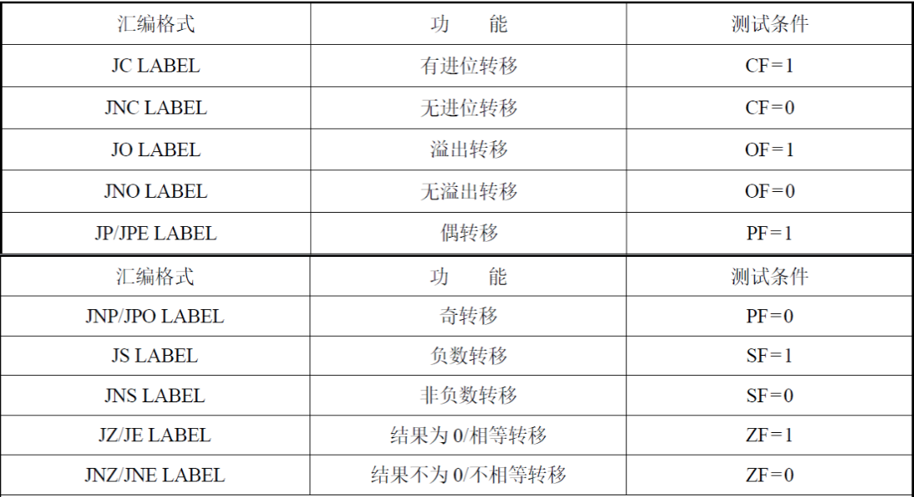

# 汇编语言与接口设计

选择题：60分，单选（1×40+2×10）

编程题：15分，难度类似字符串比较

大题：

- 一题定时器、计数器8254、8259
- 保护模式下的存储管理

- 第一章

  带宽、逆序存放

- 第二章*

  保护模式下的寄存器组、分段管理、分页管理

- 第三章

  3.1

  3.2 数据传送指令mov

  p84-87 push pop in out L1A

  p88 二进制加法

  p89

  p92 无符号惩罚

  p94 无符号除法

  95表3-3 表3-5

  3.3.1

  3.3.2

  3.3.3

  3.3.4

  p111 表3-11

  113、114 两个例子

- 第四章

  浮点运算几个概念

- 第五章

  子程序、反汇编、参数传递方式

  到5.5为止

- 第6章

  概念性

- 第7章

  

- 第8章

- 第9章

## 微型计算机硬件系统

### 微处理器及其性能指标

速度指标

- 外频：指总线的工作频率
- 倍频
- 主频：主频=外频×倍频

前端总线是指处理器南桥北桥之间的总线，数据带宽=总线频率×数据位宽/8

### 内存

内存存放当前正在执行的程序和使用的数据，CPU可直接存取，断电后内容丢失

存储器容量：以Byte为单位，KB/MB/GB/TB/PB/EB

- 字节：内存存取信息的基本单位
- 字：
- 双字

#### 存储器访问

内存物理地址以字节为单位，对于字、双字等数据类型，在访问时只需要给出最低单元的地址号，依序存取后续字节即可。

采用**逆序存放（little endian）**方式，低地址中存放低字节数据，高地址中存放高字节数据。在没有特殊说明的情况下，均使用逆序存放方式。

## 微处理器管理模式

### CPU工作模式

从80386开始，32位CPU具有3种运行模式

- 实模式

  CPU被复位（加电）时自动进入实模式，在实模式下，等同于16位8086处理器，**DOS操作系统**运行在实模式下

  - 使用1MB地址空间和16位“段首址：偏移”地址格式

  - 不支持硬件上多任务切换，不支持特权级，可执行所有特权命令

- 保护模式

  通过修改控制寄存器CR0的控制位PE实现实模式到保护模式的切换。linux、windows运行在保护模式下

  - 支持内存分页机制，提供段式和页式内存管理

  - 支持多任务和特权级，共有**4个特权级**，最高为0（操作系统），最低为3（应用程序）
  - 物理寻址空间达到4GB

- 虚拟8086模式

  又称V86模式，是为了在Windows、linux中执行Dos程序设计的，是经过"修改"的保护模式

  - 寻址方式与实模式相同

### 寄存器

可分为

- 程序可见寄存器组：汇编语言程序员在设计应用程序时可以使用的寄存器
- 程序不可见寄存器组：应用程序设计不能直接使用，但系统程序或系统运行程序期间可能要用到的寄存器

#### 程序可见寄存器组

汇编语言程序员在设计应用程序时可以使用的寄存器

- 通用寄存器

  - 数据寄存器

    - 8位：  AL/AH BL/BH CL/CH DL/DH 
    - 16位：AX       BX        CX       DX
    - 32位：EAX      EBX    ECX     EDX

    部分特殊用途

    - AX：累加器，乘法除法等运算指令专用寄存器
    - BX：可做基址寄存器
    - CX：循环计数器
    - DX：乘法除法等运算指令专用寄存器

  - 指针寄存器

    - 堆栈指针：存放当前堆栈段堆栈顶偏移量，不可随意修改

      实模式使用SP；保护模式使用ESP；

    - 基址指针：存放地址的偏移量部分

      实模式使用BP；保护模式使用EBP；

  - 变址寄存器：存放地址偏移量部分或数据

    实模式使用SI、 DI；保护模式使用ESI、 EDI；

- 段寄存器：用于确定一个存储段在内存中的起始地址，存放的是当前正在运行程序的**段选择符**

  - 代码段寄存器CS
  - 堆栈段寄存器SS
  - 数据段寄存器DS
  - 附加数据段寄存器ES

- 控制寄存器

  注意：在程序中不能直接引用控制寄存器名。  

  - 指令指针寄存器IP/EIP

    与CS段寄存器配合指出下一条要执行指令的地址，其中存放**偏移量部分**。  

  - 标志寄存器FLAGS/EFLAGS） 

    

    - CF：进位标识符，用于检测**无符号数运算是否进位**
    - PF：奇偶标识符，记录计算结果最低8位中含1的个数（偶数为1）
    - AF：辅助进位标识符，检测运算结果最低4位溢出情况，用于十进制算数运算指令
    - ZF：零标志，运算结果为0时为1
    - SF：符号标志，运算结果为-时为1
    - TF：陷阱标志，用于程序调试，为1表示CPU处于单步方式
    - IF：中断允许标志，为1表示允许响应（INTR）
    - DF：方向标志，为1时串操作自动减址，为0时自动增址
    - OF：溢出标志，**带符号运算**超出了表示范围
    - IOPL：占两位，表示IO特权级，只有特权级高于IOPL的程序才可以执行IO指令
    - NT：只用于**保护模式**，为1表示当前任务嵌套在别的程序中
    - RF：在程序调试时使用
    - VM：为1时表示工作在v86模式，只能通过任务切换置位
    - AC：地址对齐检查标志，为1时进行检查
    - VIF：虚拟中断标志
    - VIP：虚拟中断挂起标志
    - ID

#### 保护模式下的寄存器

- 全局描述符表寄存器GDTR

  可被所有任务访问，GDTR存储了**全局描述符表GDT**在内存中的基址（32位线性地址）和限长（16位）

  可通过**LGDT指令**将描述符表起始位置装入GDTR

  

  全局描述符表GDT：用于定义全局存储空间，最多含8192个**段描述符**，位于存储器中，**唯一**

- 中断描述符表寄存器LDTR

  

  中断描述符表IDT：保存**中断门描述符**，做多含256个门描述符，门描述符含8个字节，指出中断服务程序的入口

注意GDTR和IDTR的值必须在进入保护模式之前装入，可使用LGDT和LIDT指令装入

- 局部描述符表寄存器LDTR

  16位寄存器，包含**LDT描述符在GDT中的索引**

  局部描述符表LDT，每个任务都有自己的局部描述符表，其中只含有与该任务相关的段描述符

- 任务寄存器TR

  在保护模式任务切换机制中使用，是16位选择符，在GDT中根据索引值选中TSS描述符

- 任务状态TSS

  每个任务都有自己的任务转该段，任务状态TSS在存储器的及地址和限长由TR指出，存放在GDT中

- 段选择符

  在保护模式下，段寄存器的内容是段选择符，这是一个索引值，可以从GDT或LDT中找到8字节的段描述符

  

  - RPL：请求特权级，表示将要访问的段的特权级
  - TI：表指示符，为0时从GDT中选择，为1时从LDT中选择
  - Index：索引

- 控制寄存器CR0-CR3

### 内存管理

采用分段和分页结合的方式实现内存管理

#### 实模式下的分段管理

内存单元地址通过段基地址和偏移量两个逻辑地址来描述——“段基址：偏移量”

物理地址计算方式为：10H×段基址+偏移量

#### 保护模式下的分段管理

CS：EIP

- CS中存放16位段选择符，RPL与地址转换无关
- EIP存放32位偏移量
- 可认为虚拟地址空间为2^46

几个概念

- 段描述符

  用于描述代码段、堆栈段、数据段，位于GDT或LDT中，占8个字节

  

  - 段基址：32位
  - 限长：20位
  - 访问权限：8位
    - P：存在位，为1表示已经装入内存
    - DPL：描述符特权级，取值为0-3
    - S：描述符类型位，为0时表示是系统段描述符
    - E：可执行位，为1时表示是代码段后两位为C和R；为0时表示时数据段或堆栈段，后两位为ED和W
    - C：代码段特有，一致位，为1时表示是一致代码段
    - R：代码段特有，读允许位，为1时表示读允许
    - ED：数据段或堆栈段特有，扩展方向位，为1表示地址从高到低扩展
    - W：数据段或堆栈段特有，写允许位，为1表示允许写入
    - A：访问位，为1表示被访问过
  - 属性：4位
    - G：粒度位，为1时表示限长以页为单位，为0表示以字节为单位
    - D：默认操作数宽度，为1表示32位数据操作段，为0表示16位
    - AVL：可用位

- 段的地址转换

  

  - 虚拟地址

    程序指令中使用的地址，由段、偏移两部分组成

  - 线性地址

    线性地址为32位

    同一虚拟地址可能得到不同的线性地址

  - 物理地址

    物理地址是微处理器引脚输出的地址信号，CPU分页部件负责线性地址和物理地址的转换

#### 页式内存管理

页的长度固定为**4KB**，每个线性页面都映射到一个物理页面上，使用了页目录表和页表

线性地址32位，被划分为：

转化过程

- 页目录基址寄存器+页目录索引 获得 页表描述符
- 页表基址+页表索引 获得 页描述符
- 页机制 + 页面索引 获得 物理地址

页表项即页表描述符和页面描述符，均为32位，其格式为

页表项的低12位提供保护和统计功能

页目录、页表和物理页的基地址的低12位全部为0，定位在页的边界上。

### 任务

任务是指完成某功能的多个程序的集合，系统中至少存在一个任务。任务以分时的方式使个程序轮流执行。保护模式下，任何时刻二都有一个当前任务，由TR寄存器指定。

每个任务由两部分组成

- 任务执行环境TES

  任务执行环境包括一个代码段、堆栈段和数据段等，任务在每一个特权级上执行时都有一个堆栈段。

  

- 任务状态段TSS

  104个字节，保存了任务的各种状态信息，可以实现任务的挂起和回复，在任务切换过程中起重要作用。

  TSS描述符属于系统描述符，S位等于0，必须放在GDT表中，其类型位Type值为1001或1011，1011表示该任务正在执行或者被挂起

#### 门

一种转换机构，可以实现不同特权级别之间的控制传送

门描述符属于系统描述符，其格式为

- 调用门

  用于控制传送，改变任务或者程序的特权级别

  类型为4或C时表示调用门

- 任务门

  用于执行任务切换，任务门内的选择符必须只是GDT中的TSS描述符

#### 任务切换

四种情况

- 执行远程JMP 或者CALL 指令，选择了GDT 中的TSS 描述符。
- 执行远程JMP 或者CALL 指令，从GDT 或者LDT 中选择了任务门。
- 发生了中断或异常，中断向量选择了IDT 中的任务门。
- 当FLAGS 中的NT=1 时，执行IRET 指令，目的任务选择符在执行IRET 任务的TSS链接域中。

任务切换可以分为

- 直接任务切换

  

  要求TSS的DPL ≥ MAX（CPL，RPL）

- 间接任务切换

  

  要求Gate的DPL ≥ MAX（CPL，RPL）

任务切换的步骤为

- 把寄存器现场保存到当前任务的TSS（任务A的TSS）。
- 把指示目标任务（任务B）TSS的选择符装入TR寄存器中，同时把对应TSS的描述符装入TR的高速缓冲寄存器中。
- 恢复当前任务（任务B）的寄存器现场。
- 进行链接处理。
- 把CR0中的TS标志置为1，这表示已发生过任务切换，在当前任务使用协处理器指令时，产生故障（向量号为7）。
- 把TSS中的CS选择符的RPL作为当前任务特权级，设置为CPL。
- 装载LDTR寄存器。
- 装载代码段寄存器CS、堆栈段寄存器SS和各数据段寄存器及其高速缓冲寄存器。

### 保护

保护模式下设置了0，1，2，3四个特权级，阻止了非法访问

#### 数据访问的保护

程序访问某段并将选择DS前，将会与段描述符进行验证

- 存在检查：P位如果为0表示还未装入主存

- 段类型是否一致：目标段的类型是否与待操作段寄存器类型一致，此外，读写操作也存在限制

- 限长检查

- 特权级检查

  要求：DPL ≥ MAX(CPL, RPL)

  - DPL：描述符特权级，位于描述符中
  - CPL：CS寄存器的最低两位
  - RPL：请求特权级

  

#### 对程序的保护

- 直接转移的保护

  同一代码段内部转移时只需要检查限长

  段间转移时，检查限长、特权级CPL和DPL

  - CPL=DPL，允许跳转和调用。
  - CPL<DPL，禁止。高特权级不能转移到低特权级
  - CPL>DPL，此时要检查段描述符的C位。如果C位为1，表示这是一致代码段,允许跳转和调用。

  一致代码段是指操作系统用于**共享的代码段**，被调用时特权级与调用者保持一致，转移前后CPL不变

  

  非一致性代码段是指操作系统保护的系统代码段，只能允许特权级相同的程序间访问

  

- 间接转移的保护

  

  需要满足两个条件

  - DPLgate ≥ MAX（CPL，RPL）
  - DPLcode ≤ CPL

#### 对输入输出的保护

CPU采用**I/O特权级IOPL**和**TSS段中I/O许可位图**的方法来控制输入/输出，实现输入/输出保护。

## 指令系统

### 数据寻址方式

MOV 目标,源

#### 立即寻址方式

操作数包含在指令中，紧跟在操作码之后。只能出现在源操作数位置

MOV  AX,1234H

#### 寄存器寻址方式

操作数直接包含在寄存器内

MOV  EBX,EAX

#### 直接寻址方式

操作数的有效地址EA包含在指令中，EA是操作数地址的**偏移量部分**，需要与段基址进行相加得到物理地址

MOV EAX, [00404011H]

MOV  AX,VAR	；VAR是内存的符号地址

#### 寄存器间接寻址方式

操作数有效地址在基址寄存器BX、BP或变址寄存器SI、DI中，而操作数在存储器中的寻址方式。

若指令中使用的是BX、SI、DI、EAX、EBX、ECX、EDX、ESI、EDI，则缺省情况操作数在数据段，即它们默认与DS段寄存器配合。

MOV  AL,[BX];（DS:[BX]）→AL

若使用的是BP、EBP、ESP,则缺省情况默认与SS段寄存器配合。

MOV  AX,[BP]  ;（SS:[BP]）→AX 

#### 寄存器相对寻址方式

操作数的有效地址是一个基址(BX、BP)或变址寄存器(SI、DI)的内容和指令中给定的一个**位移量（disp）**之和。

使用这种寻址方式可以访问一维数组

MOV  AL,8 [BX]	可以表示为：MOV  AL,[BX+8]

MOV  AL,TABLE[BX]	可以表示为：MOV  AL,[BX+TABLE]

#### 基址变址寻址方式

操作数的有效地址是一个基址寄存器和一个变址寄存器的内容之和。

基址寄存器确定缺省情况下的段寄存器

MOV  AL, [BX] [SI];（DS:[BX+SI]）→AL

#### 相对基址变址寻址方式

操作数的有效地址是一个基址和一个变址寄存器的内容和指令中给定的**一个位移量**之和

EA＝（基址寄存器）＋（变址寄存器）＋disp

MOV  AL, ARY[BX] [SI];（DS:[BX+SI+ARY]）→AL

#### 比例变址寻址方式

EA＝（基址寄存器）＋（变址寄存器）×比例因子＋disp 

### 数据运算指令

#### 数据传送指令

除了目的地址为标志寄存器的传送之外，其他指令不影响标志

- 传送指令MOV

  格式：MOV  DST，SRC

  功能：SRC（源）→DST（目标）

  注意：源操作数目标操作数类型必须匹配，传送方向必须遵循以下规则

  - 立即数不能作为目标操作数；
  - 立即数不能直接送段寄存器；
  - 目标寄存器不能是CS；
  - 两个段寄存器间不能直接传送；
  - 两个存储单元之间不能直接传送。

  对于立即数传送到存储单元中的情况，必须进行类型显示说明

  MOV    WORD PTR[BX],10

  此外，MOV还可以实现地址传送，借助SEG和OFFSET操作符

  - MOV AX,SEG TAB

    把TAB的**段基址**送给AX寄存器

  - MOV DI,OFFSET TAB

    把TAB的**偏移量**送给DI寄存器

- 堆栈操作指令

  - PUSH

    格式：

    PUSH  SRC

    功能：

    SP = SP - 2/4

    SS:SP = (SRC)

    注意：在80286以上的机器中，SRC还可以是立即数。

  - POP

    格式：

    POP  DST

    功能：

    (DST) = SS:SP 

    SP = SP + 2

- 交换指令XCHG

  格式：XCHG  OPR1,OPR2

  功能：交换两个操作数。

- 输入输出指令

  - IN

    格式：IN  ACR,PORT

    功能：把外设端口（PORT）的内容传送给累加器（ACR）。

    注意：累加器为AL、AX、EAX，对应8位、16位、32位数据。

  - OUT

    格式：OUT  PORT,AC

    R功能：把累加器的内容传送给外设端口。

- 地址传送指令LEA

  格式：LEA REG,SRC

  功能：把源操作数的有效地址送给指定的寄存器。

  注意：REG必须是寄存器，SRC必须是存储器操作数

- 标志传送指令

  - PUSHF

    格式:PUSHF

    功能: SP减2；FLAGS→栈顶单元。

  - POPF

    格式：POPF

#### 二进制运算指令

- 二进制加法指令

  - ADD

    格式：ADD  DST,SRC

    功能：（DST）＋（SRC）→ DST

    注意：对操作数的限定同MOV指令

    标志：影响OF、SF、ZF、AF、PF、CF标志。

    - 无符号数相加若使CF置1，表示溢出
    - 带符号数相加结果若使OF置1，表示溢出。

  - 带进位加法指令ADC

    格式:ADC  DST,SRC

    功能:（DST）＋（SRC）＋CF → DST

    注意，该指令适用于多字节或多字的加法运算

  - 加1指令INC

    格式：INC  DST

    功能：（DST）＋1→DST

    注意，不影响CF标志位

- 二进制减法指令

  - SUB

    格式：SUB  DST,SRC

    功能：（DST）－（SRC）→ DST

  - 带借位减法指令SBB

    格式: SBB  DST,SRC

    功能: (DST)－(SRC)－CF → DST

    该指令适用于多字节或多字的减法运算。

  - 减1指令DEC

    格式：DEC  DST

    功能：(DST)－1→DST

- 比较指令CMP

  格式:CMP  DST,SRC

  功能:(DST)－(SRC)，影响标志位

- 乘法指令

  - 无符号乘法指令MUL

    格式：MUL  SRC

    功能：实现两个无符号二进制数乘。

    注意，该指令只含一个源操作数，不能是立即数, 另一个乘数必须事前放在累加器中。可以实现8位、16位、32位无符号数乘。

    - 字节型乘法：(AL)×(SRC)8→AX
    - 字型乘法：(AX)×(SRC)16→DX:AX
    - 双字型乘法：(EAX)×(SRC)32→EDX:EAX

  - 带符号乘法指令IMUL

    格式1：IMUL  SRC

    格式2：IMUL  REG,SRC	；REG和SRC的长度必须相同，REG为目标

- 除法指令

  - 无符号除法指令 DIV

    格式：DIV  SRC

    功能：实现两个无符号二进制数除法。

    该指令只含一个源操作数，该操作数作为除数使用，注意它不能是立即数。被除数必须事前放在隐含的寄存器中。

    - 字节型除法：(AX)/(SRC)8→商AL,余数AH
    - 字型除法：(DX:AX)/(SRC)16→商AX,余数DX
    - 双字型除法：(EDX:EAX)/(SRC)32→商EAX,余数EDX

  - IDIV

#### 逻辑运算指令

#### 移位指令

- 逻辑移位：无符号数
- 算数移位：带符号数

- 循环移位
- 带进位的循环移位

### 程序控制指令

- 转移指令

  - 无条件转移指令JMP

    格式：JMP 目标

    功能：无条件转移到目标处。

    目标的寻址方式可以分为

    - 段内转移

      只影响指针IP值

      - 段内直接转移

        - 短转移

          位移量为8位，格式：JMP  SHORT  LAB  

        - 近转移

          位移量为16/32位，格式：JMP  LAB 或 JMP  NEAR  PTR  LAB

      - 段内间接转移

        

    - 段间转移

      影响IP和CS。

      需要双字变量或6字节变量，变量由偏移量和段基址组成，注意是逆序存放

      - 段间直接转移

        格式：JMP  FAR  PTR  LAB 

      - 段间间接转移

        用一个双字内存变量中的低16位取代IP值，高16位取代CS值

        该双字变量的地址可以由除立即寻址和寄存器寻址方式以外的其它与数据有关的寻址方式获得。

  - 条件转移指令

    注意条件转移指令**只能段内转移**

    - 检测单个条件标志位转移指令表

    

    - 根据两个**带符号数**比较结果实现转移的条件转移指令
      - 大于 JG
      - 小于 JL
      - 大于等于 JGE
      - 小于等于 JLE
    - 根据两个无符号数比较结果实现转移的条件转移指令
      - 大于 JA
      - 小于 JB
      - 大于等于 JAE
      - 小于等于 JBE

- 循环指令

  - LOOP

    格式：LOOP  LABEL

    功能：(CX)－1→CX，若(CX)≠0，则转向标号处执行循环体，否则顺序执行下一条指令。

- 子程序指令

  - CALL

    格式：CALL  DST

    功能：调用子程序。执行时先把返回地址压入堆栈，再形成子程序入口地址，最后把控制权交给子程序。

    与JMP的相同点

    - 段内直接／间接调用、段间直接／间接调用、

    与JMP的不同点

    - CALL转移后要返回，所以要保存返回地址；
    - JMP转移后不再返回,所以不必保存返回地址。

  - RET

    格式1：RET

    功能：按照CALL指令入栈的逆序，从栈顶弹出返回地址（弹出一个字到IP，若子程序是FAR型还需再弹出一个字到CS），然后返回到主程序继续执行。

    格式2：RET 立即数

    功能：按照CALL指令入栈的逆序，从栈顶弹出返回地址（弹出一个字到IP，若子程序是FAR型还需再弹出一个字到CS）,返回到主程序，并修改栈顶指针SP＝(SP)＋imm16。

    注意：修改堆栈指针是为了废除堆栈中主程序传递给子程序的参数。

- 中断指令

  - INT 
  - IRET
